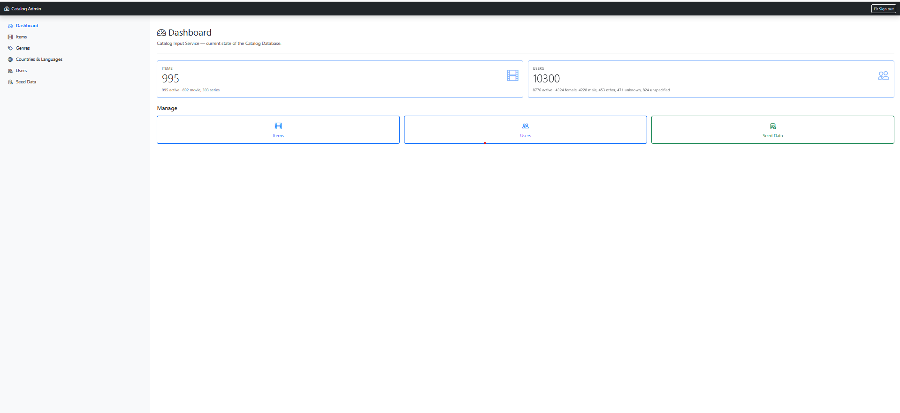
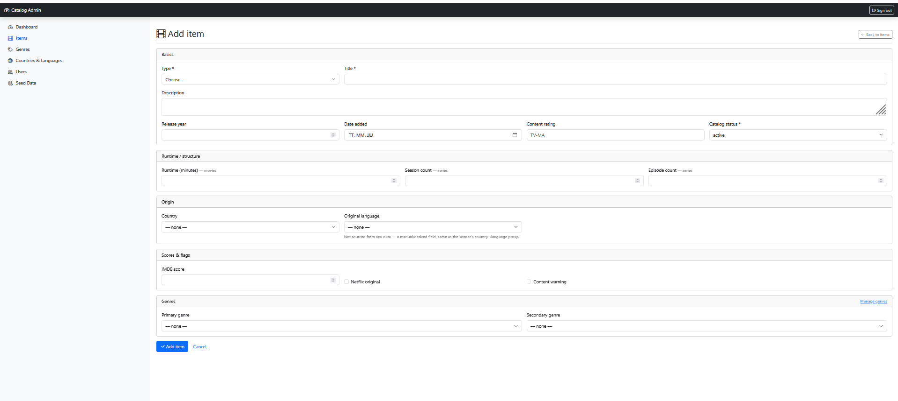
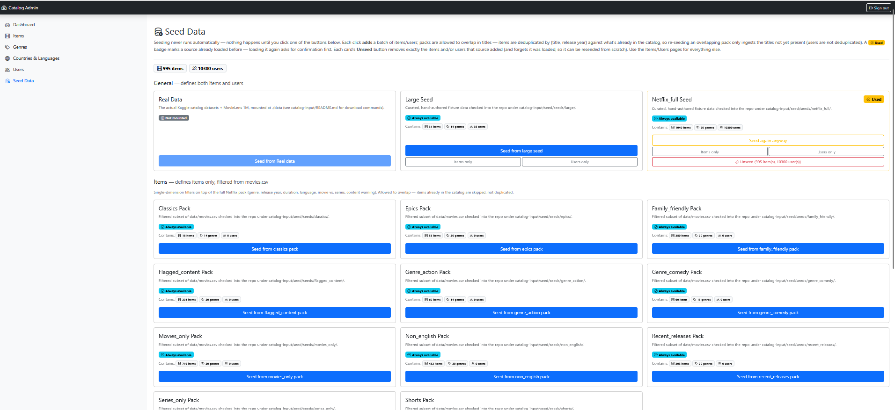
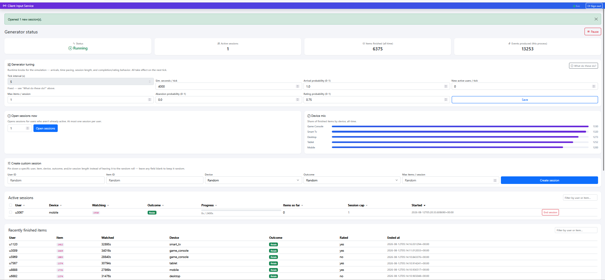
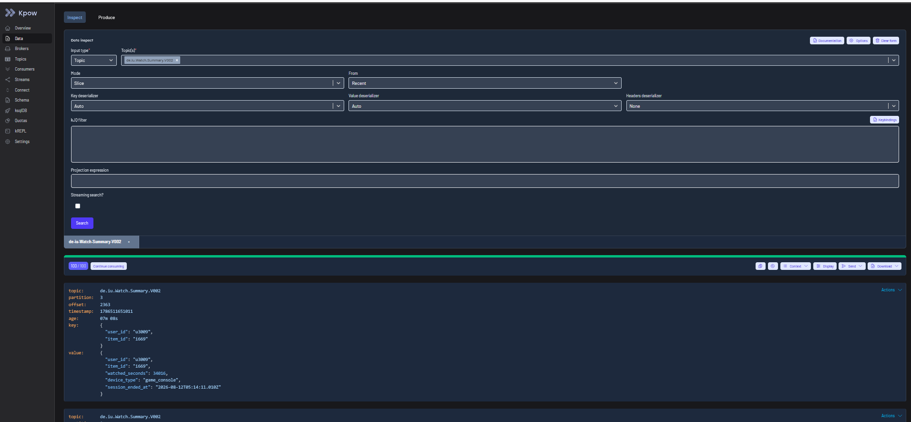
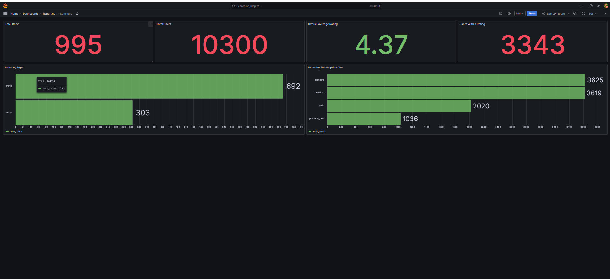
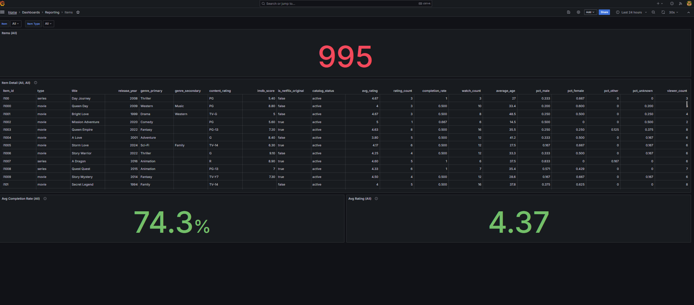
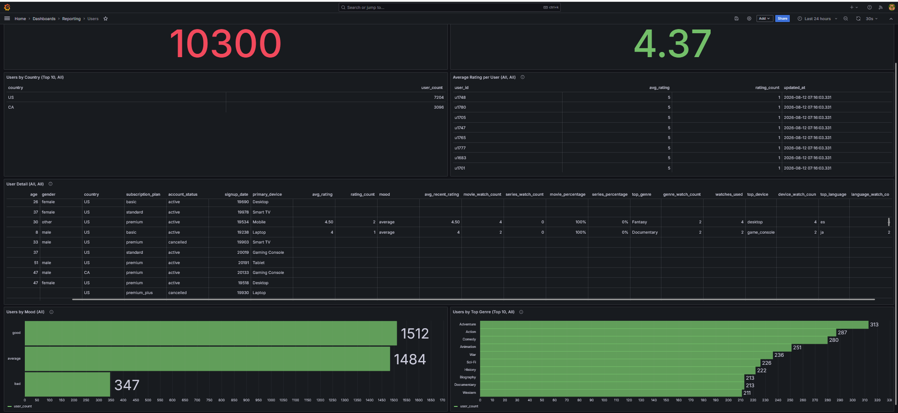
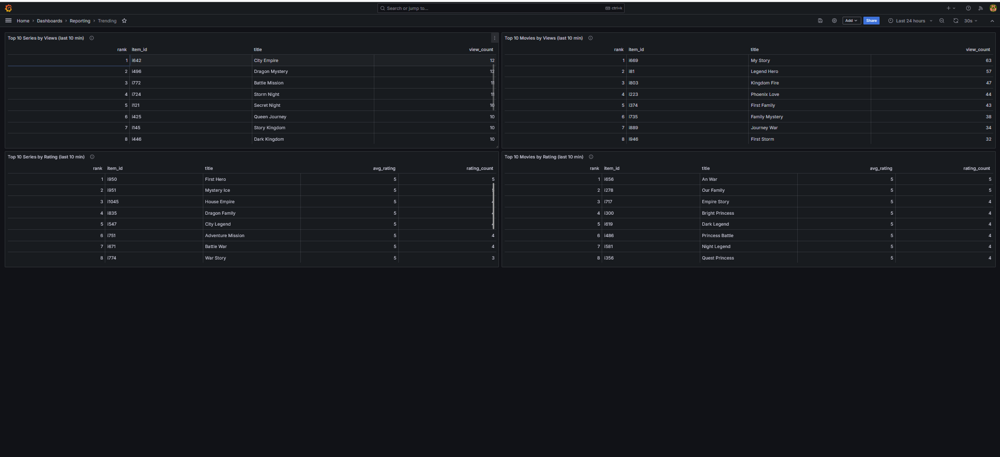

# Application Impressions

Screenshots of the running stack, one per screen that actually matters —
a quick visual sense of what each bounded context looks like in practice,
alongside the architecture/reasoning docs. See
[`README.md`](README.md)'s Quickstart to bring this up yourself; each
section below links to the doc that covers the *how* behind what's shown.

## Catalog Input

Flask/Jinja/Bootstrap CRUD + seeding UI over `catalog-db` — see
[`catalog-input/README.md`](catalog-input/README.md).

Landing dashboard: live item/user counts straight from `catalog-db`
(active/movie/series split for items; active/gender/unspecified split for
users), plus shortcuts into Items, Users, and Seed Data.

The Items → Add form. Every field here maps directly to a column on
`catalog-db.item` (see `catalog-input/postgres/init/01_schema.sql`) —
`original_language` is a manual/derived field, not sourced from raw seed
data, same as the seeder's own country→language proxy.

Seeding is deliberately not automatic — this page is where it actually
happens. General packs (Real Data, Large Seed, Netflix_full) seed both
items and users; the item-only packs below filter `movies.csv` along a
single dimension (genre, release year, language, movie vs. series,
content warning). A "Used" badge marks a source already loaded before;
each card's own **Unseed** button removes exactly what that source added.

## Client Input

The synthetic watch/rating event generator + status dashboard — see
[`client-input/README.md`](client-input/README.md) and
[`watch-summary/README.md`](watch-summary/README.md) for what happens to
these events downstream.

Generator status, live tuning knobs (`tick_interval` shown fixed — see
`client-input/README.md`'s "Event model" for why it's no longer a live
dial), manual session controls, device-mix breakdown, active sessions,
and a running log of recently finished items — everything this page
shows is driven by the SQLite state `generator.py` maintains alongside
its Kafka production.

## Kafka (via kPow)

`de.iu.Watch.Summary.V002` — `watch-summary-service`'s settled,
one-record-per-watch output, inspected live in kPow. Note the key/value
shape (`{user_id, item_id}` / `watched_seconds`, `device_type`,
`session_ended_at`): identical to `de.iu.Watch.Event.V002`'s own
schema, by design — see `watch-summary/README.md`.

## Reporting Output (Grafana)

Four dashboards over `reporting-db`, fed by the 10 scheduled SQL jobs —
see [`reporting-output/README.md`](reporting-output/README.md).

**Summary** — pure aggregates, no filters: total items/users, overall
average rating, items by type, users by subscription plan.

**Items** — Item Detail, `LEFT JOIN`ed against `item_rating_avg`,
`item_completion_rate`, and `item_viewer_demographics`. The rightmost
columns (`average_age`/`pct_male`/`pct_female`/`pct_other`/
`pct_unknown`/`viewer_count`) are `item-viewer-demographics`, the newest
job in the directory — note `pct_*` summing to `1.0` on every row that
has one.

**Users** — Users by Country, Average Rating per User, User Detail
(`LEFT JOIN`ed against five per-user tables including the newest,
`user_top_device_language` — `top_device`/`top_language` near the right
edge), Users by Mood, and Users by Top Genre.

**Trending** — rolling top-10 series/movies by view count and by rating,
last `TRENDING_WINDOW_MINUTES`, computed by `trending-rankings`.
