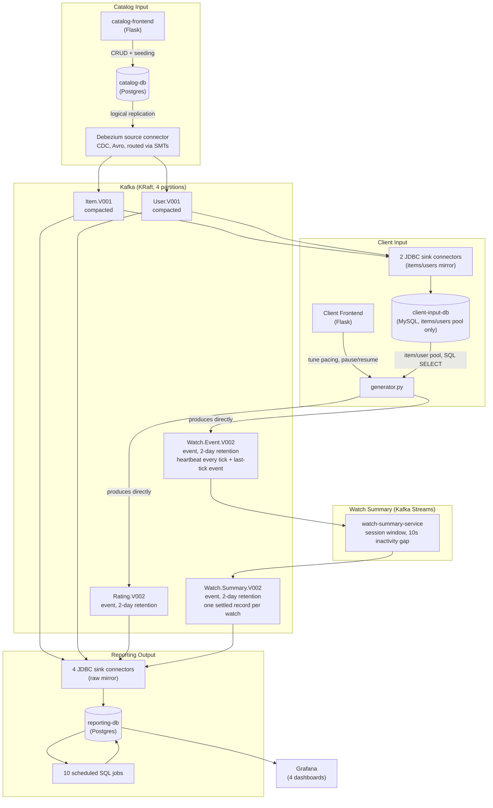
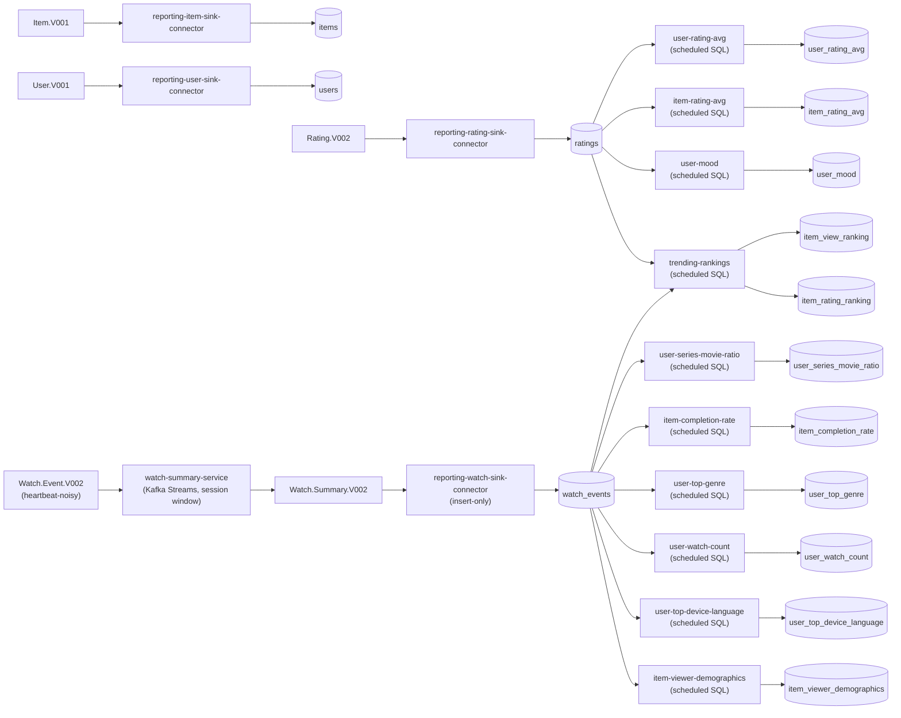
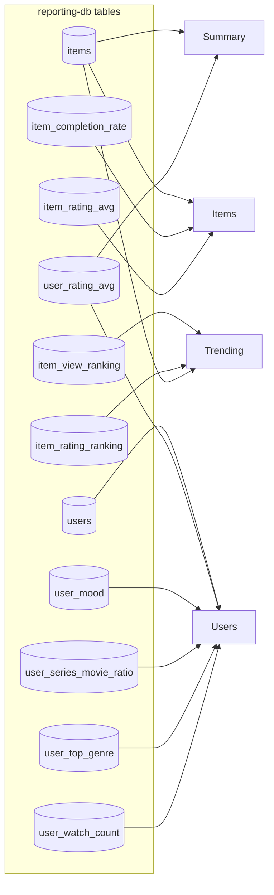

# Architecture — Real-Time Feature Serving Pipeline

This is the system-level reference: what's running, and how
data moves between the pieces. For per-bounded-context detail and
validation walkthroughs, see
[`catalog-input/README.md`](catalog-input/README.md),
[`client-input/README.md`](client-input/README.md), and
[`reporting-output/README.md`](reporting-output/README.md).

## System overview

Three bounded contexts share one Kafka cluster as their only integration
point, plus one stream-processing job (`watch-summary-service`, Kafka
Streams — see [`watch-summary/README.md`](watch-summary/README.md)) that
sits entirely inside Kafka between two of them, with no database or
frontend of its own.

`Item.V001`/`User.V001` feed several different kinds of consumer the same
way: `client-input`'s 2 JDBC sink connectors mirror them into
`client-input-db` (so `generator.py` only ever references real,
currently-active items/users via a plain SQL query), and in
`reporting-db`, `ratings`/`watch_events` carry a `FOREIGN KEY ... ON
DELETE CASCADE` back to `items`/`users` — a rating/watch event can never
reference a deleted item/user, since the row is either rejected on
insert or removed by the cascade the instant the item/user is deleted.
Six of the 10 SQL jobs (`ROSQL` above) join against `items`/`users` to
pull a column their aggregation needs — `type`, `genre_primary`,
`original_language`, `age`/`gender`. See "Reporting pipeline detail"
below.

`client-input`'s own domain data (`Rating`/`Watch.Event`) is produced
straight to Kafka: `generator.py` runs a plain
`confluent_kafka.SerializingProducer` (hand-authored Avro,
`client-input/schemas/*.avsc`), no database in front of it.
`Watch.Event.V002` carries a message every tick for every in-progress
item now, not just once at outcome — there's no separate "finished" event
on the wire any more, just whichever tick happens to be last for a given
`(user_id, item_id)`. `watch-summary-service` is the only consumer of
that raw, heartbeat-noisy stream: it session-windows on 10 seconds of
inactivity and republishes exactly one settled record per watch to
`Watch.Summary.V002` — same key/value schema as `Watch.Event.V002` — which
`reporting-watch-sink-connector` reads instead, so `reporting-db` and the
10 SQL jobs never see the heartbeat noise. See
[`watch-summary/README.md`](watch-summary/README.md) for why this one job
is Kafka Streams when the rest of `reporting-output` is plain scheduled
SQL instead.

## Kafka topic catalog

Every topic is namespaced `de.iu.<Entity>.<Version>` and versioned only
for breaking schema changes (compatible/additive changes stay on the same
topic).

| Topic | Type | Key | Written by | Read by |
|---|---|---|---|---|
| `de.iu.Item.V001` | compacted | `item_id` | Debezium (CDC from `catalog-db.item`) | JDBC sink → `reporting-db.items`; JDBC sink → `client-input-db.items` |
| `de.iu.User.V001` | compacted | `user_id` | Debezium (CDC from `catalog-db.app_user`) | JDBC sink → `reporting-db.users`; JDBC sink → `client-input-db.users` |
| `de.iu.Rating.V002` | delete, 2-day retention | `{user_id, item_id}` | `generator.py` (direct produce) | JDBC sink → `reporting-db.ratings` |
| `de.iu.Watch.Event.V002` | delete, 2-day retention| `{user_id, item_id}` | `generator.py` (direct produce, every tick) | `watch-summary-service` (Kafka Streams) |
| `de.iu.Watch.Summary.V002` | delete, 2-day retention| `{user_id, item_id}` | `watch-summary-service` (Kafka Streams) | JDBC sink → `reporting-db.watch_events` |

`Item`/`User` are compacted because they're changelogs of the catalog's
actual current state — latest value per key, deletes propagate as tombstones. `Rating.V002`/`Watch.Event.V002`/`Watch.Summary.V002`
are the opposite: plain event streams, not state updates, and neither is a
rebuild source any consumer relies on, so none needs to retain more
than a short operational window (2 days, long enough to ride out a
connector outage). `Watch.Event.V002` and `Watch.Summary.V002` look
similar (same key, same value shape) but serve different roles: the
former is raw and heartbeat-noisy (a message per tick per in-progress
item), the latter is `watch-summary-service`'s settled, one-record-per-
watch republish of it — see "Reporting pipeline detail" below.
All 10 SQL jobs query the Postgres tables. `reporting-db`'s own `ON DELETE CASCADE` (`reporting-output/postgres/`) is
additionally cleaning up `reporting-db.ratings`/`watch_events` when an
item/user is deleted — entirely independent of Kafka, see "Reporting
pipeline detail" below.

## Reporting pipeline detail

Ten scheduled SQL jobs and four JDBC sink connectors are the
computed/mirrored layer over the raw topics above, all landing in
`reporting-db` for Grafana to read. None of the ten touch Kafka at all:
once the sink connectors mirror `Rating.V002`/`Watch.Summary.V002` into
`reporting-db.ratings`/`watch_events`, every job is a plain SQL query
(`GROUP BY` or a window-function ranking) against those tables, re-run on
a timer via `psycopg2` — six of the ten also join `items`/`users` to pull
a column the aggregation needs (`type`, `genre_primary`,
`original_language`, `age`/`gender`).

Which `reporting-db` tables feed which Grafana dashboard:

(Six of the ten SQL jobs also join `items`/`users` to pull a column the
aggregation needs (`type`/`genre_primary`/`original_language`/
`age`/`gender`) — omitted above for brevity. The other four
(`user-rating-avg`, `item-rating-avg`, `user-mood`, `user-watch-count`)
don't join `items`/`users` at all: `ratings`/`watch_events` carry a
`FOREIGN KEY ... ON DELETE CASCADE` back to both tables, so a row
referencing a deleted item/user can't exist to filter out in the first
place — see "System overview" above.
`user-top-device-language`/`item-viewer-demographics` feed the Users/Items
dashboards' own Detail tables via the same `LEFT JOIN` pattern as every
other per-user/per-item metric — not shown as separate boxes in this
diagram since neither has its own standalone panel, same reasoning
`reporting-output/README.md`'s Grafana section gives for not having
separate per-genre/per-mood tables either.)

| Job / connector | Reads | Writes | Computes |
|---|---|---|---|
| `reporting-item-sink-connector` | `Item.V001` | `items` | raw CDC mirror, upsert + delete |
| `reporting-user-sink-connector` | `User.V001` | `users` | raw CDC mirror, upsert + delete |
| `reporting-rating-sink-connector` | `Rating.V002` | `ratings` | raw mirror, upsert on `(user_id,item_id)` (no delete — never carries a tombstone, see "Where each entity actually lives" below) |
| `reporting-watch-sink-connector` | `Watch.Summary.V002` | `watch_events` | raw mirror, insert-only (`pk.mode=none`, tombstones dropped at the connector) |
| `user-rating-avg` *(scheduled SQL)* | `ratings` | `user_rating_avg` | all-time average rating per user |
| `item-rating-avg` *(scheduled SQL)* | `ratings` | `item_rating_avg` | all-time average rating per item |
| `user-mood` *(scheduled SQL)* | `ratings` | `user_mood` | good / average / bad, from avg of last 3 ratings |
| `trending-rankings` *(scheduled SQL)* | `ratings`, `watch_events` (+`items` for `type`) | `item_view_ranking`, `item_rating_ranking` | rolling top-10 by view count / by rating, last 10 min |
| `user-series-movie-ratio` *(scheduled SQL)* | `watch_events` (+`items` for `type`) | `user_series_movie_ratio` | all-time movie/series watch percentage |
| `item-completion-rate` *(scheduled SQL)* | `watch_events` (+`items` for `runtime_minutes`/`type`) | `item_completion_rate` | all-time % of watches ≥85% completed |
| `user-top-genre` *(scheduled SQL)* | `watch_events` (+`items` for `genre_primary`) | `user_top_genre` | most-watched primary genre, last 8 watches |
| `user-watch-count` *(scheduled SQL)* | `watch_events` | `user_watch_count` | distinct items watched + total watches per user |
| `user-top-device-language` *(scheduled SQL)* | `watch_events` (+`items` for `original_language`) | `user_top_device_language` | most-used device + most-watched original language, all-time |
| `item-viewer-demographics` *(scheduled SQL)* | `watch_events` (+`users` for `age`/`gender`) | `item_viewer_demographics` | average viewer age + male/female/other/unknown sex distribution |

Each job's own README (linked from `reporting-output/README.md`) has a
more detailed internals diagram and the  SQL query.

## Where each entity actually lives

A quick map of "who owns this data" — useful when a number looks wrong
and the question is which table to trust.

| Entity | Source of truth | Mirrored to | Notes |
|---|---|---|---|
| Item, User | `catalog-db` (Postgres) | `Item.V001`/`User.V001` (Kafka) → `reporting-db.items`/`users`, `client-input-db.items`/`users` (minimal) | Edits only ever happen in `catalog-db` via Catalog Admin or seeding |
| Rating | `generator.py` — produced directly, no upstream database | `de.iu.Rating.V002` (Kafka) → `reporting-db.ratings` | Plain `confluent_kafka.SerializingProducer` (hand-authored Avro), one produce call per rating, no MySQL/CDC hop in front of it (see `client-input/README.md`'s "How events actually reach Kafka now"). `reporting-rating-sink-connector` mirrors it into Postgres (upsert on `(user_id,item_id)` — "latest wins" is enforced there, not upstream), which every reporting SQL job reads instead of Kafka. A rating referencing a since-deleted item/user is cleaned up in `reporting-db` by its own `ON DELETE CASCADE` (declared directly in `reporting-output/postgres/init/01_schema.sql`), not anything Kafka-side. |
| Watch event | `generator.py` — produced directly every tick, no upstream database | `de.iu.Watch.Event.V002` (Kafka, raw/heartbeat-noisy) → `watch-summary-service` (Kafka Streams, session window) → `de.iu.Watch.Summary.V002` (Kafka, settled) → `reporting-db.watch_events` | One `ItemFinishedEvent` produce call per tick per in-progress item, not one per watch — there's no separate "finished" event on the wire, see `client-input/README.md`. `watch-summary-service` is the only consumer of the raw topic; it's what decides, via a 10s inactivity gap, which record was last for a given `(user_id, item_id)` and republishes just that one, insert-only downstream (`reporting-watch-sink-connector`'s `pk.mode=none` — a rewatch legitimately repeats `{user_id, item_id}`, so there's nothing to upsert against; `watch_events.id` is a plain surrogate `BIGSERIAL`). `reporting-db.watch_events` gets its own `ON DELETE CASCADE` (declared directly in `reporting-output/postgres/init/01_schema.sql`) for the same since-deleted-item/user cleanup — entirely independent of Kafka, since nothing reads `reporting-db`'s WAL. See `client-input/README.md` and `watch-summary/README.md`. |
| Computed metrics (`user_rating_avg`, `item_rating_avg`, `user_mood`, `user_series_movie_ratio`, `item_completion_rate`, `user_top_genre`, `user_watch_count`, `user_top_device_language`, `item_viewer_demographics`, `item_view_ranking`, `item_rating_ranking`) | Recomputed from scratch every tick — scheduled SQL over `reporting-db` (`ratings`/`watch_events`/`items`/`users`) for all ten | `reporting-db` | Derived from input topics/tables, not separately maintained. `item_viewer_demographics` is the one exception that dedupes to distinct `(item_id, user_id)` viewers first — see its own README. |
