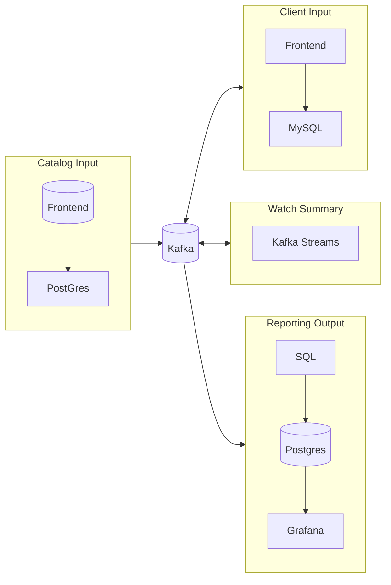

# Real-Time Feature Serving Pipeline (Netflix-style)

Portfolio project for **Data Engineering (DLMDSEDE02)**, IU Internationale
Hochschule — Task 2: build a real-time data backend for a data-intensive
application.

For the system-level diagrams (full bounded-context data flow, the Kafka
topic catalog, and the reporting pipeline in detail), see
**[`ARCHITECTURE.md`](ARCHITECTURE.md)**.

## Architecture



| Doc | Covers |
|---|---|
| [`catalog-input/README.md`](catalog-input/README.md) | Postgres CDC (Debezium) → Kafka (Avro, compacted) + Catalog Admin CRUD/seeding UI |
| [`client-input/README.md`](client-input/README.md) | synthetic watch-event/rating generator + dashboard |
| [`watch-summary/README.md`](watch-summary/README.md) | Kafka Streams — session-windows watch heartbeats into one settled record per watch |
| [`reporting-output/README.md`](reporting-output/README.md) | JDBC sink connectors + 10 scheduled SQL jobs + 4 Grafana dashboards |
| [`ARCHITECTURE.md`](ARCHITECTURE.md) | full data-flow diagram, Kafka topic catalog, reporting pipeline detail |
| [`ENTERPRISE_ARCHITECTURE.md`](ENTERPRISE_ARCHITECTURE.md) | what running this at production scale would require |
| [`APPLICATION_IMPRESSIONS.md`](APPLICATION_IMPRESSIONS.md) | screenshots of every service actually running |

## Quickstart

Requires Docker Desktop.

```bash
cp .env.example .env   # fill in the KPOW_* license vars and FRONTEND_*/CLIENT_INPUT_*/GRAFANA_* credentials — see .env.example

docker compose up
```
(`kpow` needs a free license in `.env` — see `.env.example` — but isn't
profile-gated any more, so it comes up with everything else above.)

Then:

1. Open http://localhost:5000 (**Catalog Admin** — sign in with your
   `FRONTEND_*` credentials) and use its **Seed Data** page to load either
   the bundled `small`/`large` fixture sets or real Kaggle data — seeding
   is deliberately not automatic. (CLI alternative:
   `docker compose --profile seed run --rm catalog-seed`.)
2. Once the catalog has data, open http://localhost:5001 (**Client
   Input** — sign in with your `CLIENT_INPUT_*` credentials) to watch the
   synthetic watch/rating event generator run.
3. Once the first item sessions are done, open http://localhost:3000 (**KPow**) to watch the
   various data streams (Kafka Topics and Connectors) in Kafka
4. Open http://localhost:3001 (**Grafana** — sign in with your
   `GRAFANA_ADMIN_*` credentials). The **Reporting** folder has four
   dashboards: Summary, Items, Users, Trending.

See [`catalog-input/README.md`](catalog-input/README.md),
[`client-input/README.md`](client-input/README.md),
[`watch-summary/README.md`](watch-summary/README.md), and
[`reporting-output/README.md`](reporting-output/README.md) for what each
service does and how to validate each path end-to-end.

Tear down:
```bash
docker compose --profile seed down -v
```

## Repo layout

```
docker-compose.yml       all services in the stack
ARCHITECTURE.md          system-level diagrams (data flow, Kafka topic catalog)
ENTERPRISE_ARCHITECTURE.md   what running this at production scale would require, incl. TLS implementation notes
APPLICATION_IMPRESSIONS.md   screenshots of every service actually running
images/                   screenshots referenced by APPLICATION_IMPRESSIONS.md
kafka/                    shared Kafka bootstrap (topic creation), used by kafka-init
connect/                  shared Kafka Connect worker image (Debezium + JDBC sink + Avro converter)
catalog-input/            Postgres + Debezium + Kafka + Schema Registry
catalog-input/frontend/   Catalog Admin — Flask/Jinja/Bootstrap CRUD + seeding UI
client-input/             synthetic watch/rating event generator + dashboard
watch-summary/            Kafka Streams job — the one genuine stream-processing service here
reporting-output/         JDBC sink connectors + 10 scheduled SQL jobs + Grafana dashboards
```

## Where to look for what

| Question | Where |
|---|---|
| How does data flow between services? | [`ARCHITECTURE.md`](ARCHITECTURE.md) |
| What's the Catalog Admin CRUD/seeding UI do? | [`catalog-input/README.md`](catalog-input/README.md) |
| How does the synthetic event generator work? | [`client-input/README.md`](client-input/README.md) |
| What's the one Kafka Streams job, and why does it exist? | [`watch-summary/README.md`](watch-summary/README.md) |
| What do the 10 reporting SQL jobs compute, and how? | [`reporting-output/README.md`](reporting-output/README.md) |
|  What would a real rollout need? | [`ENTERPRISE_ARCHITECTURE.md`](ENTERPRISE_ARCHITECTURE.md)'s Security section |
| What does it actually look like running? | [`APPLICATION_IMPRESSIONS.md`](APPLICATION_IMPRESSIONS.md) |
