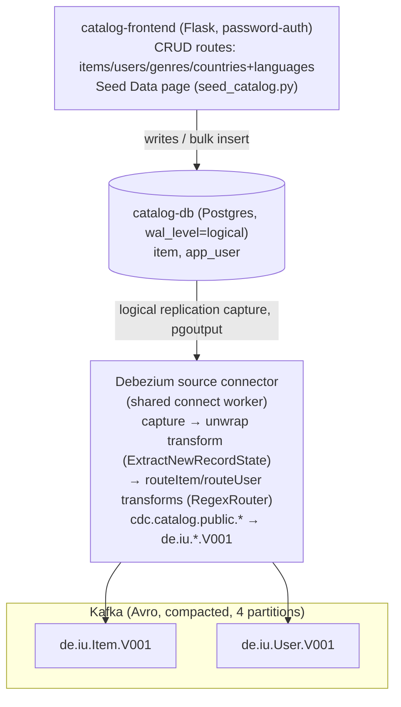
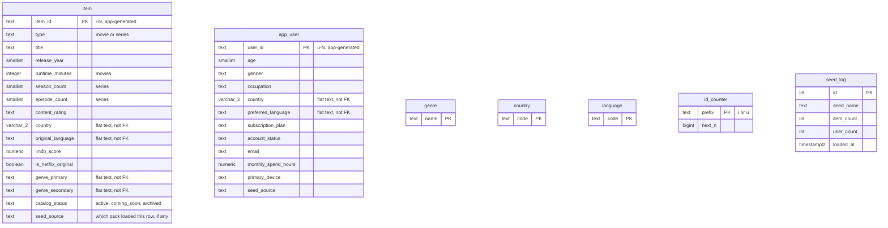
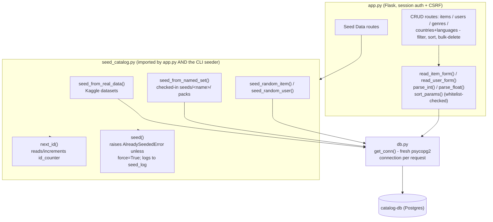

# Catalog Input Service

A Postgres catalog database, CDC'd via Debezium into two compacted, Avro,
4-partition Kafka topics.



Every write this service makes — whether through the CRUD UI or the seed
script — lands in Postgres first and only reaches Kafka via CDC; there's
no direct producer anywhere in this bounded context. That's deliberate:
`catalog-db` stays the single source of truth, and every downstream
consumer (`client-input`, `reporting-output`) only ever sees what
actually committed to Postgres, in commit order, including deletes
(tombstones — see "Validating this service" below).

Genre is a flat `genre_primary`/`genre_secondary` pair of columns on `item`
(capped at 2, mirroring the movies.csv-shaped source it can be seeded from),
not its own table/topic.

`Catalog Admin` isn't in the original architecture diagram — added later at
the user's request (see "Catalog Admin frontend" below). It's just another
writer to the same Postgres tables; every change it makes flows through the
same CDC path as the seed script's inserts.

## What's here

| Path | Purpose |
|---|---|
| `postgres/init/01_schema.sql` | `item` / `app_user` DDL, auto-applied on first Postgres start |
| `kafka/create-topics.sh` | Creates the 2 master-data topics (4 partitions, `cleanup.policy=compact`) |
| `connect/Dockerfile` | `cp-kafka-connect-base` + Debezium Postgres connector + Confluent Avro converter (via `confluent-hub`) |
| `connect/catalog-source-connector.json` | Debezium connector config: CDC source, Avro/Schema-Registry, topic routing to `de.iu.*.V001` names |
| `connect/register_connector.py` | Waits for Connect's REST API, then registers the connector (idempotent) |
| `seed/seed_catalog.py` | Seeding logic (real Kaggle data, a named `seeds/<name>/` fixture set, or the movies.csv-shaped "Netflix pack" family) — imported by both the CLI seeder and the frontend, single source of truth |
| `seed/seeds/large/` | General-purpose curated fixture set (~30 titles, Soeiro/MovieLens shape) — real static file, not runtime-generated. |
| `seed/seeds/netflix_full/` + 13 filtered packs (`genre_action`, `recent_releases`, `series_only`, `flagged_content`, `young_adults`, ...) | Native movies.csv/users.csv shape (see `data/movies.csv`/`data/users.csv`) — `netflix_full` is every row unfiltered; the rest are single-dimension filters (genre, release year, duration, language, movie/series, content warning, user age, ...) generated from the same two source files, meant to overlap. Each pack defines items only, users only, or both — see `categorize_seed()`/`categorized_available_seeds()` in `seed_catalog.py`, which is what groups them into the Seed Data page's General/Items/Users sections |
| `frontend/` | Catalog Admin — Flask/Jinja/Bootstrap CRUD UI + dashboard + seeding page (see below) |
| `schemas/*.avsc` | The actual Avro key/value schemas currently registered in Schema Registry, exported for reference (see "Registered Avro schemas" below) |

## Schema



No foreign keys anywhere in this schema — a deliberate choice, not an
oversight. `item`/`app_user` are the two CDC'd domain entities and have no
relationship to each other or to anything else. `genre`/`country`/
`language` look like they should be reference tables `item.genre_primary`/
`country`/`original_language` (and the `app_user` equivalents) point at,
but those columns stay flat, unconstrained text — the three vocabulary
tables only exist to power Catalog Admin's dropdown menus (`app.py`
queries them for `<select>` options) and are deliberately excluded from
CDC (an admin-UI concern, not part of the domain model Kafka consumers
see). `id_counter` (ID generation bookkeeping) and `seed_log` (admin
seeding history) are pure operational tables, also untouched by CDC.

## Bring it up

```bash
cp .env.example .env   # fill in the KPOW_* license vars, and the FRONTEND_* credentials — see .env.example
docker compose up -d kafka schema-registry kafka-init catalog-db connect connect-register catalog-frontend kpow
```

This builds the custom `connect` image on first run (installs the Debezium
Postgres connector + Avro converter via `confluent-hub`), then:
1. starts Kafka (KRaft mode — single node acts as both broker and controller, no Zookeeper), Schema Registry, Postgres,
2. `kafka-init` creates the 2 compacted topics and exits,
3. `connect` starts Kafka Connect,
4. `connect-register` waits for Connect's REST API and PUTs the connector config, then exits,
5. `kpow` starts — it's part of the core stack, not an optional/profile-gated
   extra, used throughout this doc's validation steps to inspect
   topics/schemas/connector lag.

`kafka-init` and `connect-register` are one-off containers (`restart: "no"`) —
seeing them exit with code 0 is expected, not a failure.

**After any `docker compose down -v`** (schema changes require this — see the
ID-format note below), kPow gets torn down along with everything else and
comes back with a plain `docker compose up -d kpow` (or by including it in
the bring-up command above) — no separate profile flag needed.

### Seed the catalog

Seeding is deliberately **not automatic** — nothing loads until you explicitly
ask for it, either from the Catalog Admin UI (see below, the easier way) or
the CLI:

```bash
docker compose --profile seed run --rm catalog-seed                  # large seed set (default)
docker compose --profile seed run --rm catalog-seed --seed netflix_full        # all ~1000 movies.csv items + all users.csv
docker compose --profile seed run --rm catalog-seed --seed genre_action        # items only, filtered to genre_primary=Action
docker compose --profile seed run --rm catalog-seed --seed young_adults        # users only, filtered to age 18-30
docker compose --profile seed run --rm catalog-seed --real           # real Kaggle data from ./data
docker compose --profile seed run --rm catalog-seed --seed netflix_full --force   # override the double-seed guard
docker compose --profile seed run --rm catalog-seed --seed netflix_full --mode items   # items only, skip its users file
docker compose --profile seed run --rm catalog-seed --seed netflix_full --mode users   # users file only, skip items
docker compose --profile seed run --rm catalog-seed --random-users 25            # 25 synthetic users, no file at all
docker compose --profile seed run --rm catalog-seed --random-users               # random batch size (10-50)
```

`seeds/large/` (~30 titles, Soeiro/MovieLens shape — `titles.csv`/`users.dat`,
see seed_catalog.py's `seed_items()`/`seed_users()`) is a general-purpose
fixture set. `seeds/netflix_full/` and its
13 filtered siblings are a separate, native movies.csv/users.csv shape
(`movies.csv`/`users.csv`, see `seed_items_from_movies_csv()`/
`seed_users_from_users_csv()`) generated from `data/movies.csv`/
`data/users.csv`, filtered along one dimension each (genre, release year,
duration, language, movie vs. series, content warning, user age). Each pack
defines items only, users only, or both — `categorize_seed()` groups them
for the Seed Data page's General/Items/Users sections. Packs in either
shape are allowed to overlap in titles — items are deduplicated by (title,
release year) against what's already in the catalog (see "Not idempotent
by design" below), so loading two overlapping packs just skips whatever the
first one already added. All are curated or generated-once fixture files
checked into the repo — real static data, not generated at request time.

**Synthetic data (not from any file)**: `seed_catalog.py` can also generate
items/users with plausible-but-random field values — Faker for the free-text
fields (`title`/`description`, via `catch_phrase()`/`paragraph()` — Python's
Faker has no dedicated movie-title provider, unlike the Ruby `faker` gem's
`Movie` module, so this is the closest fit), everything else drawn from the
same controlled vocabularies (`COUNTRY_LANGUAGE`, `OCCUPATION_MAP`, etc.)
the file-backed sources use. Three entry points: `--random-users [N]` above
(bulk, CLI or the Seed Data page's "Random users" card); and two single-click
frontend buttons — "Random item"/"Random user" next to "Add item"/"Add user"
on the Items/Users pages, inserting exactly one row with immediate feedback,
no form. None of this is gated by the double-seed guard below — repeating it
is the point (same "click adds one, click again for another" model as
`client-input`'s "Open sessions now"), not a mistake to warn about.

**Double-seed guard**: every load is recorded in a `seed_log` table (not
CDC'd — pure UI/CLI bookkeeping, see `01_schema.sql`). Loading the *exact
same* source (`small`/`large`/`action`/`netflix_full`/.../`real`) a second
time raises `AlreadySeededError` and refuses, unless you pass `--force`
(CLI) or confirm the warning dialog (frontend's Seed Data page shows a
"Used" badge on anything already loaded, with a JS `confirm()` + a
server-side `confirm=yes` check backing it up — bypassing the UI with curl
still needs the explicit flag). This is a separate, narrower guard than
item-level title dedup (see below) — it catches literal repeats of one
source, not overlap between two *different* sources, which the title dedup
already handles without needing a warning.

To use the actual Kaggle datasets instead of the bundled fixture sets:

```bash
kaggle datasets download -d victorsoeiro/netflix-tv-shows-and-movies -p data/soeiro --unzip
kaggle datasets download -d shivamb/netflix-shows -p data/shivamb --unzip
# MovieLens 1M ships as a zip of .dat files, not a Kaggle-API dataset in the usual sense —
# download ml-1m.zip from https://grouplens.org/datasets/movielens/1m/ and unzip users.dat into data/movielens/
```
Expected paths: `data/soeiro/titles.csv`, `data/shivamb/netflix_titles.csv`,
`data/movielens/users.dat`. `data/` is gitignored — Kaggle/GroupLens content
isn't ours to redistribute; the seed fixture files are (hand-authored).

**Not idempotent by design, with one exception**: `item_id`/`user_id` are
prefixed, sequentially assigned ids (`i1`, `i2`, `u3` — next available
number per prefix, derived from current DB state) and inserts are plain
`INSERT`s, not upserts. `app_user` rows are NOT deduplicated across
repeated runs — loading the same seed set twice adds a second full batch of
users. `item` rows ARE deduplicated, but by a natural key, (`title`,
`release_year`), not by source id — see `existing_item_keys()` in
`seed_catalog.py`. This is what makes overlapping packs (see "Seed the
catalog" above) safe to load in any order: activating a pack that shares
titles with an already-seeded one just skips those titles, it doesn't
duplicate them. Every inserted item *and user* also gets a `seed_source`
column stamped with the pack name (or `"real"`/`"random_items"`/
`"random_users"`) — the Seed Data page's **Unseed** button uses it to
remove exactly the rows one source added (and forgets that source was
loaded, so it can be reseeded from scratch), without touching hand-added
rows (`seed_source` is `NULL` for those) or other sources' rows.

**Id generation is concurrency-safe**: `make_id_counter()` takes a
`pg_advisory_xact_lock` keyed on the id prefix (held until the calling
transaction commits, so a second concurrent writer blocks instead of
racing against the same max+1) and scans the table only once, then hands
out ids from memory for the rest of the batch. `next_id()` is a thin
single-id wrapper around it, used by the frontend's one-row-per-request
admin forms; every batch loader (`seed_items()`,
`seed_items_from_movies_csv()`, `seed_users()`,
`seed_users_from_users_csv()`, `seed_random_items()`,
`seed_random_users()`) calls `make_id_counter()` directly. Concurrently
seeding `netflix_full` and a filtered pack finishes in under 10 seconds
combined, with no duplicate-key errors.

This tradeoff exists because, with the frontend now also able to create
rows, ids must come from actual DB state rather than each writer keeping
its own counter (or they could collide) — and once that's true, full
upsert idempotency isn't really achievable without storing every source's
natural key, so seeding became an explicit, repeatable admin action instead
("full control over the data," in the user's words) rather than an
idempotent sync — hence the double-seed guard above for sources loaded
twice, and item-level dedup for the same title arriving via two different
sources. If you do confirm/force a double-seed of a source that overlaps
with itself in some other way, or just want to start over, use Unseed or
the Items/Users pages.

**Gotcha hit while authoring the fixture CSVs**: an unquoted comma inside a
text field (e.g. `description`) shifts every column after it by one —
`csv.DictReader` doesn't error, it just misaligns the row, so a `genres`
value can silently land in `country` and Postgres rejects it with an opaque
`value too long for character varying(2)` that points nowhere near the real
problem. Hit this exact bug in two of the genre-pack rows. `load_soeiro()`
now validates field counts up front and names the offending row instead of
letting it fail downstream — if you add fixture rows by hand, wrap any text
field that might contain a comma in double quotes.

### Catalog Admin frontend

Flask + Jinja + Bootstrap 5.3 CRUD UI over the Catalog Database, with
session-based password authentication and CSRF protection (Flask-WTF) on
every state-changing route. Not part of the original architecture diagram —
added later at the user's request. Every add/edit/delete is a plain write to the
same `catalog-db` tables the seed script and Debezium already know about, so
it flows through CDC exactly the same way.



`seed_catalog.py` being imported directly by `app.py` (not called as a
subprocess/CLI) is why `frontend/Dockerfile`'s build context is
`catalog-input/` rather than `catalog-input/frontend/` — it needs to
`COPY seed/seed_catalog.py` and `seed/seeds/` into the frontend's own
image (see `frontend/Dockerfile`).

```bash
docker compose up -d catalog-frontend
```

Open **http://localhost:5000**, sign in with `FRONTEND_ADMIN_USERNAME` /
`FRONTEND_ADMIN_PASSWORD` from `.env` (defaults in `.env.example` are
placeholders — change them). Pages:
- **Dashboard** (landing page) — current item/user counts (items broken
  down active vs. archived, movie vs. series; users broken down active count
  and by gender) with quick links to every subpage
- **Items** — list/add/edit/delete `item` rows; `genre_primary`/
  `genre_secondary`, `country`, and `original_language` are all dropdowns
  (genre capped at 2, still flat text columns on `item` — see "Genres"/
  "Countries & Languages" below, not a join table) rather than free text;
  list page supports filtering (id substring, genre, type, status — each
  dropdown option shows its row count, e.g. "drama (22)"), sortable columns
  (click a header, click again to reverse), multi-select bulk delete
  (select-all checkbox + "Delete selected"), and a "Random item" button
  next to "Add item" that inserts one synthetic item immediately, no form
- **Genres** — add/delete the vocabulary that powers the Items form's
  genre dropdowns. A lightweight controlled-vocabulary table
  (`genre(name)`): no join table, no Kafka topic, `item.genre_primary`/
  `genre_secondary` unchanged. Deleting a genre clears that field on every
  item that used it (bulk cleanup, not a blocked delete) rather than
  leaving an orphaned off-list value
- **Countries & Languages** — same pattern as Genres, one page with two
  independent managed lists (`country(code)`, `language(code)`) powering
  the Items/Users forms' country/language dropdowns. Independent, not a
  paired mapping — `item.country`/`item.original_language` (and the
  `app_user` equivalents) are already separate, unenforced columns, so
  there's nothing to keep in sync between the two lists. These two tables
  are the live source for both the dropdowns and random item/user
  generation; `seed_catalog.py`'s hardcoded `COUNTRY_LANGUAGE` dict is only
  a fallback when both tables are empty (a fresh, unseeded database). Both
  real-data/named-set seeding and the "Random
  item"/"Random user" buttons keep the two tables in sync with whatever
  values actually get used, same `ensure_*`/`sync_*_from_*` pattern as
  Genres
- **Users** — list/add/edit/delete `app_user` rows (name/email/location/
  usage fields alongside demographics/subscription, `country`/
  `preferred_language` dropdowns same as Items); filter by id substring
  plus gender/plan/status (same per-option counts as Items), sortable
  columns, same bulk-delete support, and a "Random user" button next to
  "Add user" (same one-click pattern as Items)
- **Seed Data** — trigger `seed_from_real_data()` / `seed_from_named_set()`
  from `seed_catalog.py` on demand (see "Seed the catalog" above), grouped
  into **General** (defines both items and users — real data, `large`,
  `netflix_full`), **Items** (movies.csv-filtered packs), **Users**
  (users.csv-filtered packs), and **Random** (synthetic, see below) — see
  `categorize_seed()` in `seed_catalog.py`. Shows current row counts, a
  "contains N items/M genres/K users" preview per source computed without
  touching the DB (genres here means distinct genre names in the source
  file, not a stored entity), and a "Used" badge (+ confirm gate) on
  anything already loaded. General-category cards also have "Items
  only"/"Users only" secondary buttons (tracked as distinct
  `<name>:items`/`<name>:users` history keys, since Items/Users-only packs
  have nothing to split); and once a source has added any rows, an
  **Unseed** button that removes exactly the items *and* users that source
  added and forgets the load happened — a separate "Random" section
  generates a batch of random users/items on demand, each with its own
  Unseed button

New rows get ids via the same `make_id_counter()`/`next_id()` scheme as the
CLI seeder (see "Id generation is concurrency-safe" above). Bulk
delete uses `DELETE ... WHERE id = ANY(%s)` (one statement, one CDC-visible
transaction per click) rather than looping single deletes.

Filters and sort are plain `GET` query params (`?genre=Comedy&type=movie&sort=imdb_score&dir=desc`)
— bookmarkable, and every "Clear filters" / column-header link just builds a
new query string rather than needing JS state. Sort columns are matched
against a per-page whitelist (`ITEMS_SORT_COLUMNS` etc. in `app.py`) before
ever reaching SQL — psycopg2 can't parameterize identifiers the way it does
values, so an unvalidated `?sort=` would be a real injection vector if it
went straight into `ORDER BY`. Each dropdown's per-option counts (e.g.
"drama (22)") are computed over the **full, unfiltered** table via a
separate `GROUP BY` query per dropdown — not the current filtered result
set — so picking one filter doesn't shift the numbers shown in the others.

**Security posture** (simple auth, deliberately scoped for a local-dev
portfolio project — see `../ENTERPRISE_ARCHITECTURE.md`'s Security section
for what production would need instead): single shared admin credential
(not per-user accounts), compared via
`hmac.compare_digest` (not hashed — consistent with how this project already
handles its other local-dev credentials). No TLS yet — plain HTTP, like the
rest of the stack currently. Fine for local dev, worth hardening before this
goes anywhere else.

### Observability

```bash
docker compose up -d kpow
```
kPow UI at http://localhost:3000 — browse topics/partitions, inspect
registered Avro schemas, watch `catalog-source-connector` lag live. Part of
the core stack (see "Bring it up" above); just needs a free community
license in `.env` (see `.env.example`) — no longer profile-gated.

## Registered Avro schemas

All 2 topics' key/value schemas are auto-derived by Debezium from the
Postgres table definitions + the connector's SMT chain, and auto-registered
in Schema Registry on first produce — they aren't hand-written. `schemas/*.avsc`
are exported copies of what's actually registered right now (fetched via
`GET /subjects/<subject>/versions/latest`), checked in as documentation.

This is deliberate: a hand-authored schema not byte-for-byte matching what
Debezium emits would fail Schema Registry's compatibility check on the next
produce. If the Postgres schema or connector config changes, re-export
rather than hand-editing the `.avsc` files:

```powershell
foreach ($s in @("de.iu.Item.V001-key","de.iu.Item.V001-value","de.iu.User.V001-key","de.iu.User.V001-value")) {
  (Invoke-RestMethod "http://localhost:8081/subjects/$s/versions/latest").schema |
    ConvertFrom-Json | ConvertTo-Json -Depth 20 | Set-Content "catalog-input\schemas\$s.avsc"
}
```

Note the key schemas carry plain `string` id fields (`item_id`, `user_id`)
with no semantic-type annotation, since `item_id`/`user_id` are plain
`TEXT` columns in Postgres.

**`date_added`/`signup_date` use the standard Connect `Date` logical type,
not Debezium's own `io.debezium.time.Date`** — `catalog-source-connector.json`
sets `"time.precision.mode": "connect"` for exactly this reason. Debezium's
default (`io.debezium.time.Date`, still an Avro `int` epoch-day underneath)
is a Debezium-specific `connect.name` that `reporting-output`'s JDBC sink
connectors don't recognize, so they'd bind it as a plain integer against a
`DATE` column and Postgres rejects the implicit cast — this was invisible
as long as `auto.create=true` let the sink connector make its own
(wrongly-typed, `INTEGER`) column to match. Once `reporting-output/postgres/init/01_schema.sql`
started declaring real `DATE` columns (see that file's history note),
this had to be fixed at the source instead: `time.precision.mode=connect`
makes Debezium emit the standard `org.apache.kafka.connect.data.Date`
name the JDBC sink already knows how to bind via `java.sql.Date`. Doesn't
touch `created_at`/`updated_at` — Debezium always emits `ZonedTimestamp`
as an ISO-8601 string regardless of this setting; that half is instead
handled on the `reporting-output` sink connectors via `?stringtype=unspecified`
on their JDBC connection URL (see `reporting-output/README.md`).

## Validating this service

1. **Schema applied**: `docker compose exec catalog-db psql -U catalog -d catalog -c '\dt'` → 3 tables (`item`, `app_user`, `seed_log`).
2. **Topics exist, compacted, 4 partitions**: `docker exec de-realtime-kafka-1 kafka-topics --bootstrap-server localhost:9092 --describe --topic de.iu.Item.V001`.
3. **Connector running**: `curl http://localhost:8083/connectors/catalog-source-connector/status` → `"state":"RUNNING"` for both connector and task.
4. **Avro schemas registered**: `curl http://localhost:8081/subjects` → 4 subjects (`-key`/`-value` × 2 topics).
5. **Seed lands in Kafka**: after `catalog-seed`, message counts per topic should roughly match row counts seeded (check via kPow, or `kafka-run-class kafka.tools.GetOffsetShell --broker-list localhost:9092 --topic de.iu.Item.V001 --time -1`).
6. **CDC on UPDATE**: change a row in Postgres (e.g. `UPDATE item SET title = 'x' WHERE item_id = 'i1';`) and confirm the topic's offset advances.
7. **CDC on DELETE (tombstone)**: delete a row and confirm the topic's offset advances by exactly **1** — this is what lets compaction actually remove the key, since state must always be rebuildable from offset 0. The plain console consumer doesn't Avro-decode, so the reliable check is the offset delta (`GetOffsetShell` before/after), not eyeballing values; kPow's topic viewer also shows it directly.

   Getting to exactly 1 took a fix: Debezium can produce *two* null-value records per delete — one from the `ExtractNewRecordState` unwrap SMT (with `delete.handling.mode: none`, it passes the delete's `after: null` straight through) and one from Debezium's own native tombstone (independent of the SMT, controlled by `tombstones.on.delete`, default on). The SMT's `drop.tombstones` flag decides whether that second, native one survives the SMT chain — we initially had it set to `"false"` (keep both), which produced 2 null records per delete. Setting `transforms.unwrap.drop.tombstones: "true"` (its actual default — we'd overridden it away from that) drops the native duplicate and leaves exactly the unwrapped one, a single tombstone.
8. **Frontend login gated**: `curl -o /dev/null -w '%{http_code}' http://localhost:5000/items` (no cookie) → `302` to `/login`, not `200`.
9. **Frontend CRUD flows through CDC**: seed from the UI's Seed Data page (or add an item manually) and confirm the Kafka offset moves — same check as #5/#6, different entry point.
10. **Item dedup on overlapping packs**: seed a pack, then seed a different pack that shares titles with it (e.g. `genre_action` after `netflix_full`) and confirm the flash message / CLI output reports the shared titles as skipped, not re-inserted — `item` row count should grow by only the *new* titles, not the full pack size.

All 10 were exercised manually while building this service.
The seed path: 12 items / 11 users seeded via the frontend's Seed Data page
(small set), all landed in Kafka across all 4 partitions per topic. The CDC
path: a live `UPDATE` on `item` and a live `INSERT` + `DELETE` on `app_user`
each advanced the relevant topic's offset by exactly +1. The frontend path:
added an item via the UI (got `i13`, continuing the DB-derived sequence
correctly), confirmed it landed in Kafka, deleted it, and confirmed the
`item` row was gone.

## Connector image choice

The obvious choice for the CDC connector image is plain `debezium/connect`.
In practice that image doesn't ship the Confluent Avro converter, so this
service builds on `confluentinc/cp-kafka-connect-base` instead and adds the
Debezium connector + Avro converter as two `confluent-hub install` lines —
no custom Java code, just plugin installation. The Debezium connector is
pinned to the 2.5.x line rather than `:latest` (3.x): the base image ships
a Java 11 JRE, and Debezium 3.x connector jars require Java 17.

## Open items

- `item.country` / `production_countries` normalization — **decided: staying flat.**
  Not normalized into an `Item_To_Country` table/topic; no current report
  needs multi-country grouping, and normalizing preemptively would just be
  speculative complexity.
