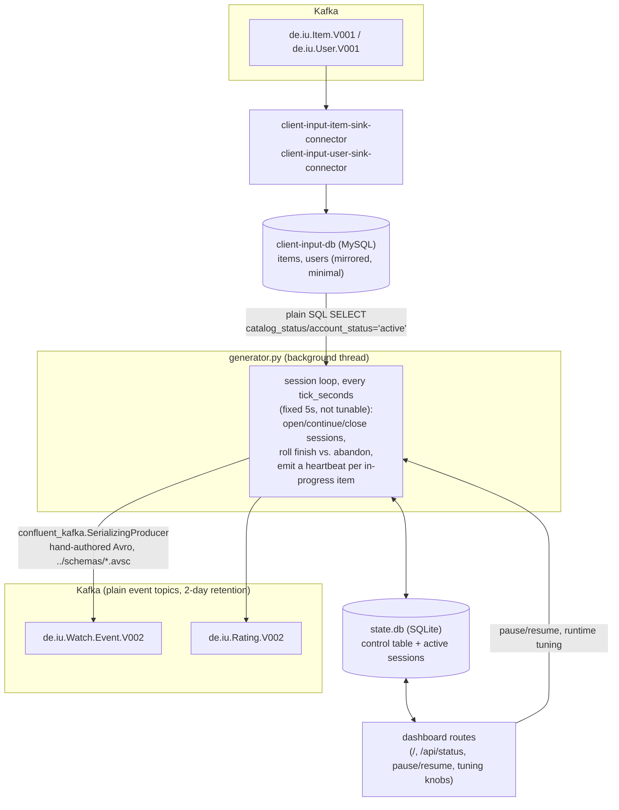
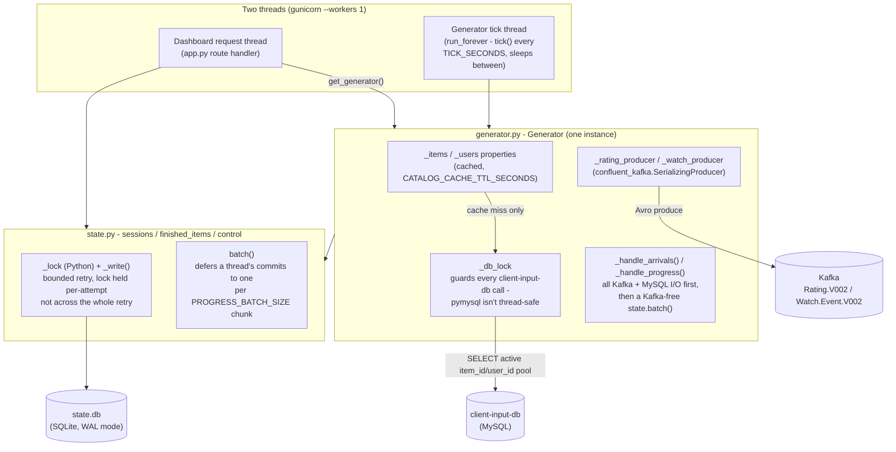

# Client Input Service

Synthetic watch/rating event generator + status dashboard. This is what
makes the pipeline actually *real-time* — `catalog-db` only changes when a
human edits it via Catalog Admin or a seed set loads; this service
continuously produces `Watch.Event`/`Rating` traffic that the reporting
layer's SQL jobs consume.

See "Event model" below for what's actually implemented, and "How events
reach Kafka" below for how this service talks to Kafka.
`Watch.Event.V002` also feeds `../watch-summary/README.md`, the one
genuine stream-processing job in this project.

## What it does



A Flask app (`app.py`) runs one background thread:

- `generator.py` runs the event loop, every `tick_seconds` (fixed at 5s in
  code, not runtime-editable from the dashboard; see "Event
  model" below for why). It reads its item/user pool with a plain
  `SELECT ... WHERE catalog_status = 'active'` / `WHERE account_status =
  'active'` against `client-input-db.items`/`users` (mirrored from Kafka by
  `client-input-item-sink-connector`/`client-input-user-sink-connector` —
  same JDBC sink pattern `reporting-output` uses, just targeting this
  service's own MySQL instead of `reporting-db`), and produces
  ratings/watch events straight to Kafka the moment each happens — see
  "How events reach Kafka" below.

## Event model

A **session** is an active user: at most one per `user_id` at a time. While
active, a session watches items one after another. There's no separate
`start`/`stop` pair — every tick publishes an `ItemFinishedEvent` for
whatever item is currently in-progress, not just once at the end.
`watched_seconds` is just the
current position on a mid-watch tick, and the item's actual final total on
whichever tick happens to be last:

```json
{
  "user_id": "u42",
  "item_id": "t1001",
  "watched_seconds": 6800,
  "device_type": "smart_tv",
  "session_ended_at": "2026-08-08T14:22:00Z"
}
```

Nothing on the wire marks a given message as "the last one" — there is no
distinct "finished" event type, just a uniform per-tick heartbeat.
`watch-summary-service` is what decides, after the fact, which one was
last (a gap of `SESSION_GAP_SECONDS` with nothing further for that
`(user_id, item_id)`) and republishes it to `de.iu.Watch.Summary.V002`.

1. **Arrivals** — with some probability, opens new sessions: picks a random
   free `user_id` (not already active) and `item_id` from the live catalog
   pool, a random device type, and decides that first item's outcome up
   front (~75% `finish`, ~25% `abandon`). Also rolls the session's
   `max_items` cap (1 to a configurable ceiling) up front — a
   "sense-making" limit, since nobody realistically binges an unbounded
   number of items back to back.
2. **Progress** — advances every active session's current item by a
   configurable number of simulated seconds per tick, and publishes an
   `ItemFinishedEvent` for it **every tick**, at whatever position it's now
   at — this is the heartbeat `watch-summary-service` relies on. Once the
   item crosses its outcome threshold, that tick's event is the last one
   for this `(user_id, item_id)` (nothing marks it as such — see above),
   and with some probability a `Rating` follows (finishers rate more often,
   and rate higher).
3. **Continuation** — after an item finishes, if the session hasn't hit its
   `max_items` cap yet it picks another item and keeps going (a fresh
   outcome roll for that item too); once the cap is reached the session
   closes, freeing the user up for a future session.

There's no `vanish` outcome *simulated* here (every session this
generator runs ends via a deliberate finish/abandon roll, never a genuine
crash), but the wire format doesn't foreclose it: a real client going
silent mid-watch would look identical to a normal finish from
`watch-summary-service`'s
side (heartbeats just stop), and it would still get a settled
`Watch.Summary.V002` record once the inactivity gap elapses. This
generator just never exercises that path itself.

**`tick_seconds` is fixed at 5s in code, not a runtime-editable dashboard
control.** `watch-summary-service`'s inactivity-gap detection
(`SESSION_GAP_SECONDS=10`, see `../watch-summary/README.md`) depends on
heartbeat cadence staying comfortably under half of that gap — raising
`tick_seconds` at runtime would risk false "abandoned" summaries mid-watch,
so it was pulled from the tunable set entirely rather than just documented
as risky.

Session bookkeeping (`sessions` table, one active row per user, plus a
`finished_items` log for the dashboard) lives in SQLite
(`client-input/state.db`, named volume `client-input-state`) — chosen over
an in-memory dict specifically so it's queryable for debugging/integration
tests. Not part of the Kafka domain model, same role as catalog-db's
`seed_log` — purely operational bookkeeping for this service.

`gunicorn` is pinned to `--workers 1`: the generator thread starts once at
app import time, so more workers would each start their own generator and
double-produce every event.

## How events reach Kafka

`generator.py` produces straight to Kafka with its own
`confluent_kafka.SerializingProducer` and hand-authored Avro schemas
(`schemas/*.avsc`) — no database or CDC hop in front of `Rating`/
`Watch.Event`. `client-input-db` (MySQL) exists only for the item/user
pool mirror (see "What it does" above); it holds no `ratings`/
`watch_events` tables and isn't part of how `Rating`/`Watch.Event` reach
Kafka.

**What this means for correctness**: a `client-input` container crash
between an event being "decided" (the tick committed to it) and the
producer successfully delivering it loses that one event, silently,
permanently. That's an accepted gap, not an oversight — this is synthetic
telemetry, not a system of record, and `generator.py` already tolerates
gaps elsewhere (`tick failed, continuing`, pause/resume). The alternative
(durability via a local outbox) was tried and cost more than it was worth
for data nothing ever reads back.

### Schema

`client-input/mysql/init/01-schema.sql` (runs once, on first container
start) declares just `items`/`users` now — intentionally minimal (only the
columns `generator.py`'s pool-selection queries read: `item_id`/`type`/
`runtime_minutes`/`catalog_status`, `user_id`/`account_status`), not a full
mirror the way `reporting-db.items`/`users` is.
`client-input-item-sink-connector`/`client-input-user-sink-connector`
(`client-input/connect/*.json`) keep them in sync from Kafka, restricted to
exactly those fields via `fields.whitelist` — deliberately **not**
"auto.create the PK, auto.evolve fills in the rest" the way the
`reporting-output` sinks work: MySQL's `ALTER TABLE ADD COLUMN` refuses a
non-optional field with no default (`Item.V001`'s `type` is exactly that),
and separately refuses a default value on any `TEXT`/`BLOB` column at all —
both hit live on first deploy, which is why the schema is hand-declared
instead. No `ratings`/`watch_events` tables, no `FOREIGN KEY`s, no
binlog config on `client-input-db` at all — see "How events reach Kafka"
above.

## Internals

Two threads touch shared state here: gunicorn's one worker thread
(`--workers 1`, handling whichever HTTP request is currently in flight —
see "Operational gotcha: two threads, two shared connections" below for
why more than one worker isn't safe) and the generator's own background
tick thread. Both go through the same `Generator` singleton
(`generator.get_generator()`) and the same `state.py` module-level
functions; the locking/caching/batching machinery below exists entirely to
make that safe and fast.



`CACHE`/`DBLOCK`/`PRODUCERS`/`TICKLOGIC` and `SLOCK`/`BATCH` aren't
decorative boxes — each one is a fix for a specific incident, detailed in
the two "Operational gotcha" sections right below this.

### Operational gotcha: two independently-persisted states can drift

Applies to the two sink connectors (item/user pool mirror):
`client-input-db`'s volume and Kafka Connect's own consumer-group offsets
are two *separate*
pieces of persisted state. After a `client-input-db` volume reset, the sink
connectors resume from their last *committed Kafka offset* — if that's
already at the end of `de.iu.Item.V001`/`User.V001` (the common case, since
they'd already caught up before the reset), they find nothing new to
replay and `items`/`users` stay empty. Fix: stop the connector
(`PUT .../stop` — `pause` alone doesn't fully release the consumer group),
`kafka-consumer-groups --reset-offsets --to-earliest`, resume. Not a bug in
the mechanism — the direct consequence of Kafka Connect state and the
target database's state being two different things that a plain volume
reset only touches one of. Worth knowing if you ever reset
`client-input-db-data` outside of a full `docker compose down -v` (which
also wipes Kafka's own offset-storage topics, so this class of drift can't
occur there).

### Operational gotcha: two threads, two shared connections

The dashboard route and the background generator tick are two different
threads (gunicorn's one worker thread plus the generator's own), and each
touches two pieces of shared local state without any driver-level
protection against concurrent access from both at once: the
`client-input-db` MySQL connection, and `state.db`.

The MySQL side went first: `free_user_ids()`/`item_ids()` (dashboard) and
the tick loop's own catalog-pool queries shared one `pymysql` connection
with no locking. `pymysql` isn't safe for concurrent use from two threads —
interleaved reads on the same socket permanently desynced the MySQL wire
protocol (a `struct.error` on the next read), which left the tick thread
stuck in a blocking read with no further logging: the generator just
stopped reacting, silently. Fixed with `generator.py`'s `_db_lock`, held
for the whole duration of each `_cursor()` call, not just connection setup.

### Operational gotcha: state.db writes under heavy concurrent load

`state.db` (SQLite) is written by two threads: the background generator
tick and whichever dashboard request gunicorn's single worker happens to
be handling. Under enough load (many active sessions, high
`SIMULATION_SPEED`) this used to fail outright — a dashboard write landing
mid-tick could hit `sqlite3.OperationalError: database is locked`, or in
one case hang both threads indefinitely. Three real, separate bugs, each
only found by actually reproducing it under real threads/timing/disk I/O
(`tests/test_integration_sqlite_concurrency.py`), not by reasoning about
the code:

- A tick's batched writes (`state.batch()`, see `generator.py`'s
  `PROGRESS_BATCH_SIZE`) used to also make Kafka `produce()` calls while
  the SQLite write-lock was held — holding a DB lock across network I/O to
  a different system, which could exceed SQLite's busy-timeout under load.
  Fixed by moving every Kafka/MySQL call outside the batch, so the batch
  itself only ever does fast, local SQLite writes.
- Even fixed, a single dashboard write could still occasionally hit
  `database is locked` — a different SQLite error class than the
  busy-timeout retry handles. Fixed with an explicit, bounded
  application-level retry (`state.py`'s `_write()`).
- That retry then caused a worse bug: its backoff sleep ran *while still
  holding* the process-level `_lock`, so one thread's multi-attempt retry
  cycle blocked every other thread's completely unrelated `state.py` calls
  for the whole retry duration — an accidental deadlock between the two
  threads this was supposed to keep independent. Fixed by acquiring
  `_lock` fresh per attempt instead of once for the whole retry.

Also added along the way: WAL mode (`state.py`'s `_conn()`) and an
in-process TTL cache for the `client-input-db` item/user pool
(`generator.py`'s `CATALOG_CACHE_TTL_SECONDS`), both aimed at the same
"lags under load" symptom from a different angle — fewer commits and fewer
MySQL round-trips competing for the same locks in the first place.

## Kafka topics

4 partitions each, both plain event topics — `cleanup.policy=delete`,
`retention.ms` = 2 days (see `../kafka/create-topics.sh`). Neither is
compacted: both are streams of things that happened, not changelogs of
current state, and neither is a source anything rebuilds from — see
`../ARCHITECTURE.md`'s "Kafka topic catalog" for the fuller reasoning.
Neither ever carries a delete/tombstone: there's no database or CDC hop in
front of either (see "How events reach Kafka" above) for a delete to come
from in the first place — `generator.py` only ever produces, never
deletes.

- `de.iu.Watch.Event.V002` — an `ItemFinishedEvent` every tick for every
  in-progress item, not just once at outcome (see "Event model" above):
  `user_id`, `item_id`, `watched_seconds`, `device_type`, `session_ended_at`.
  Keyed by a composite **Avro key** `ItemFinishedKey` (`{user_id, item_id}`)
  — the entity's actual primary key, since the same user/item pair
  legitimately recurs (rewatches). Schema: `schemas/de.iu.Watch.Event.V002-key.avsc`/`-value.avsc`.
  Raw and heartbeat-noisy by design — `../watch-summary/README.md` (Kafka
  Streams) is the only consumer, and it's what republishes a settled,
  one-record-per-watch view to `de.iu.Watch.Summary.V002` for
  `reporting-output` to read instead.
- `de.iu.Rating.V002` — post-session rating: `user_id`, `item_id`, `rating`
  (1-5), `rated_at`. Keyed by the same composite `{user_id, item_id}`
  (`RatingKey`) as `Watch.Event`. A re-rating (same `user_id`/`item_id`) is
  just produced again — `reporting-rating-sink-connector`'s
  upsert-on-`(user_id,item_id)` is what makes `reporting-db.ratings` end up
  with only the latest rating. Schema:
  `schemas/de.iu.Rating.V002-key.avsc`/`-value.avsc`.

Both hand-authored (`client-input/schemas/*.avsc`), registered under
Schema Registry subjects `de.iu.Rating.V002-key`/`-value` and
`de.iu.Watch.Event.V002-key`/`-value` (Confluent's default
`TopicNameStrategy` — no `SetSchemaMetadata`-style renaming needed the way
a Debezium-sourced connector would, since there's no auto-derived schema
to rename here). `rated_at`/`session_ended_at` are Avro `long` with
`logicalType: timestamp-millis`, matching `generator.py`'s own `_now_ms()`
helper.

Domain validation still runs client-side right before every produce
(`generator.py`'s `validate_item_finished`/`validate_rating`):
`watched_seconds > 0`, `device_type` non-empty, `rating` in 1-5, timestamps
not in the future.

## Manual session control

The dashboard isn't just a read-only view — it drives the generator directly:

- **Open sessions now** — opens N sessions immediately (`POST /sessions/add`,
  `generator.Generator.open_sessions(n)`), bypassing the per-tick arrival
  probability entirely. Skips users who already have an active session.
- **Create custom session** — same as above but every field
  (`user_id`/`item_id`/`device_type`/`outcome`/`max_items`) can be pinned
  explicitly instead of rolled randomly; any left blank still falls back to
  the normal random pick (`POST /sessions/custom`,
  `generator.Generator.open_custom_session`). Only the *first* item's
  outcome is pinned — if the session continues past it (per `max_items`),
  later items get a fresh random outcome roll same as any other session.
  `device_type` is session-level and stays fixed for the whole session
  regardless. For picking valid `user_id`/`item_id` values, the form's
  autocomplete only lists users without an active session and items
  currently in the catalog pool.
- **End session** — force-closes one specific user's session right now: cuts
  the current item short (publishes its `ItemFinishedEvent` with
  `watched_seconds` frozen at the current position) and closes the session
  outright, without rolling for continuation (`POST /sessions/<user_id>/end`,
  `generator.Generator.end_session_now`). The active-sessions table supports
  multiselect (checkboxes + "select all") and a bulk **End selected** action
  (`POST /sessions/end_bulk`) that does the same thing for each checked user.
  Both are called via `fetch()` from the dashboard's JS, not a page reload.
- **Active-sessions table** is client-side sortable (click any column header
  to sort/reverse) and filterable (free-text search over user/item), same
  for the recently-finished-items table.
- **Generator tuning** — all runtime-editable from the dashboard
  (`POST /config`), persisted in SQLite's `control` table (same volume as
  `sessions`, so it survives restarts): `simulation_speed` (simulated
  seconds advanced per tick — how fast simulated time proceeds),
  `arrival_probability`/`max_arrivals_per_tick` (how often and how many new
  active users show up — traffic volume, unrelated to what happens once
  someone's watching), `session_max_items` (ceiling for the per-session
  random item cap), `abandon_probability` (chance any given item is
  abandoned partway rather than watched to completion — this is what
  actually drives the finish/abandon split, not `arrival_probability`), and
  `rating_probability` (chance a finisher rates; abandoners rate at a fixed
  fraction of this). An in-dashboard "What do these do?" panel explains
  each one inline. The matching env vars (`SIMULATION_SPEED`,
  `ARRIVAL_PROBABILITY`, `MAX_ARRIVALS_PER_TICK`, `SESSION_MAX_ITEMS`,
  `ABANDON_PROBABILITY`, `RATING_PROBABILITY`) only seed the *initial* value
  on a fresh `state.db` — after that the dashboard value wins.
  `tick_seconds` is shown (read-only) in the same form but is **not**
  editable here — see "Event model" above for why.

## Bring it up

```bash
docker compose up -d client-input-db client-input
```

(`client-input` depends on `client-input-db` being healthy, and now also on
`kafka`/`schema-registry` directly — it produces to Kafka itself. `connect`/
`connect-register` need to be up too for the two item/user sink connectors,
and `kafka-init` needs to have created `de.iu.Rating.V002`/
`de.iu.Watch.Event.V002` first — see `../kafka/create-topics.sh`.
`docker-compose.yml` enforces this: `client-input` depends on
`schema-registry` with `condition: service_healthy` and on `kafka-init`
with `condition: service_completed_successfully`, so it won't even start
until both are actually ready. That wasn't always true — an earlier
version had no hard ordering here, and a `client-input` container that won
the startup race against either one would fail its first few produce
attempts (`KAFKA_AUTO_CREATE_TOPICS_ENABLE=false` means an unready topic is
a hard error, not an auto-create) or hang the whole generator thread
waiting on a schema-registry that hadn't finished electing its Kafka group
coordinator yet.)

Open http://localhost:5001 and sign in with your `CLIENT_INPUT_*`
credentials from `.env`. The dashboard shows live session counts, the
active-sessions table, a log of recently finished items, and a pause/resume
toggle (pausing stops the generator tick — no further events are produced
until resumed).

## Tests

```bash
pip install -r requirements-dev.txt
pytest -m "not integration"   # fast, no infra - generator.py/state.py logic against fakes/tmp SQLite
pytest -m integration          # real threads, real disk I/O, real timing - still no Docker
pytest                          # both
```

The `integration` marker here means "real threads/timing/SQLite file", not
"needs Docker" - unlike reporting-output's integration tests (see
`../reporting-output/README.md`), this service's concurrency story is fully
reproducible with `client-input-db`/Kafka faked and only `state.db` real, so
these still run in well under a second and need nothing running.

## Validation

- Dashboard login gate works (unauthenticated request redirects to `/login`).
- `docker compose exec client-input-db mysql -u client_input -pclient_input client_input -e "select count(*) from items; select count(*) from users;"` —
  counts should track live catalog items/users (`catalog_status`/
  `account_status = 'active'`).
- `docker compose exec kafka kafka-run-class kafka.tools.GetOffsetShell --broker-list kafka:29092 --topic de.iu.Watch.Event.V002` —
  offsets advance roughly every 5s per active session (one heartbeat per
  in-progress item per tick), not just once per watch.
- `docker compose exec kafka kafka-topics --bootstrap-server kafka:29092 --describe --topic de.iu.Watch.Event.V002` —
  confirms no `cleanup.policy=compact` (unlike the catalog-input topics) and
  `retention.ms=172800000`.
- `docker compose logs client-input` — no repeating delivery-report errors
  once the stack has been up a few seconds (a few at startup, before
  `kafka-init` finishes, are expected — see "Bring it up" above).
- `docker compose exec client-input sqlite3 /app/state/state.db "select count(*) from sessions"` /
  `"select count(*) from finished_items"` — cross-check against the
  dashboard's own counters.
- kPow (http://localhost:3000) — inspect topic messages and schema
  directly under `de.iu.Rating.V002`/`de.iu.Watch.Event.V002`; confirm
  events are landing and the registered schemas match `client-input/schemas/*.avsc`.
- Delete an item via Catalog Admin (http://localhost:5000) that already has
  ratings/watch events, and confirm `reporting-db.ratings`/`watch_events`
  drop that item's rows within a few seconds — this is `reporting-db`'s own
  `ON DELETE CASCADE` (declared in `reporting-output/postgres/init/01_schema.sql`),
  not anything client-input-side; see `../reporting-output/README.md`'s
  "Retention" section.
- Pause via the dashboard, confirm offsets stop advancing; resume, confirm
  they resume.
