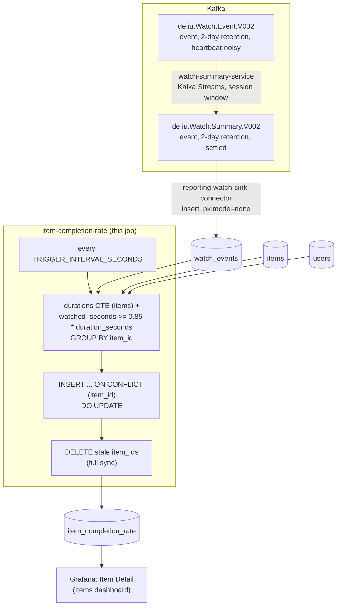

# item-completion-rate

All-time completion rate per item (movie or series). A periodic SQL query
against `reporting-db`.

## What it computes

For every item with at least one live watch: `completion_rate` (the
fraction of its watches where `watched_seconds >= 0.85 * duration_seconds`)
and `watch_count`. Written to `reporting-db.item_completion_rate`, keyed by
`item_id`.

`duration_seconds` is `runtime_minutes * 60` for a movie, or a fixed
40-minute (`DEFAULT_EPISODE_SECONDS`) assumption for a series — the
catalog has no per-episode runtime field, the same simplification
`client-input/generator.py`'s own internal "finish" threshold band already
makes. This is the *fraction* of watches that crossed the threshold, not
the average fraction watched — different numbers; this project only needs
the former.

Every watch event counts (no dedup) — `watch_events` is an insert-only
mirror of an append-only topic, and a rewatch is a second real data point
about whether people who start this item tend to finish it, not a
duplicate to collapse away. Watches for a deleted item or user don't count
(`INNER JOIN` against live `items`/`users`), and the table is fully
synced every tick.

## Job graph



## Validation

```bash
docker compose exec reporting-db psql -U reporting -d reporting \
  -c "select count(*), min(completion_rate), max(completion_rate) from item_completion_rate;"
```
`completion_rate` should be within `[0, 1]` for every row. Watch a
`client-input` session finish an item past the 85% threshold and confirm
the matching row's `completion_rate`/`watch_count` updates within one
`TRIGGER_INTERVAL_SECONDS`.
