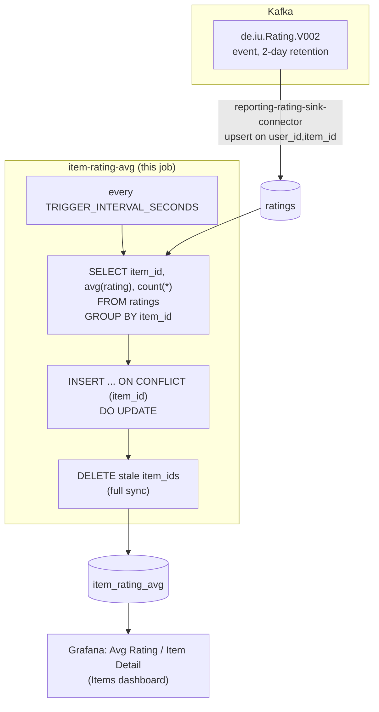

# item-rating-avg

All-time average rating per item — the item-side mirror of
`../user-rating-avg/README.md`. A periodic SQL query against
`reporting-db`, same as that job — a trivial addition once `ratings`
existed as a real Postgres table.

## What it computes

For every item with at least one live rating: `avg_rating` (mean of
`rating` across every rating it's ever received) and `rating_count`
(count of *distinct users* who've rated it). Written to
`reporting-db.item_rating_avg`, keyed by `item_id`.

Same rules as `user-rating-avg`, just grouped by `item_id` instead of
`user_id`: latest rating per `(user_id, item_id)` wins (enforced by
`reporting-rating-sink-connector`'s upsert, not by this job), ratings for
a deleted item/user can't exist here in the first place (`ratings`'s
`FOREIGN KEY ... ON DELETE CASCADE` against `items`/`users` — see
`../user-rating-avg/README.md`), and it's a full sync every tick (an
`item_id` missing from this tick's aggregate has its row deleted, not
left stale).

## Job graph



## Validation

```bash
docker compose exec reporting-db psql -U reporting -d reporting \
  -c "select count(*), min(avg_rating), max(avg_rating) from item_rating_avg;"
```
`avg_rating` should be within 1-5 (the rating scale) for every row; rows
should track the count of items with at least one live rating, not the
full catalog.
