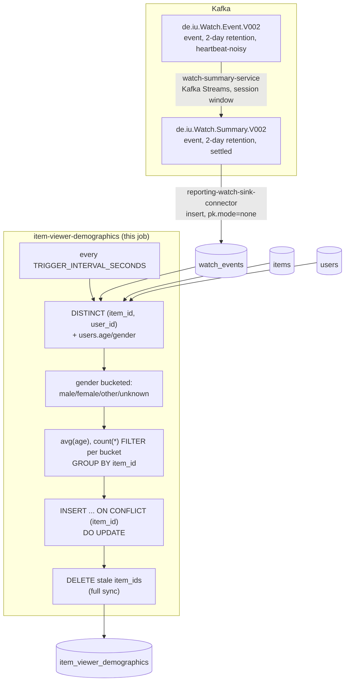

# item-viewer-demographics

Each item's viewer average age and sex distribution. A periodic SQL query
against `reporting-db`.

## What it computes

For every item with at least one live watch: `average_age` (mean age of
its **distinct** viewers, nullable if every viewer has a null age) and a
four-way sex distribution — `pct_male`/`pct_female`/`pct_other`/
`pct_unknown`, each in `[0, 1]` and always summing to exactly `1.00`.
`unknown` absorbs both a null `users.gender` and any value outside the
three named categories, so every viewer lands in exactly one bucket by
construction. `viewer_count` (distinct viewers, not watch events) is
also written for context. Written to
`reporting-db.item_viewer_demographics`, keyed by `item_id`.

**Distinct viewers, not raw watch events — a deliberate exception to
this directory's usual "every watch event counts" rule** (see
`../item-completion-rate/README.md`/`../user-series-movie-ratio/README.md`).
Those jobs count repeat watches because a rewatch is a second real data
point about *behavior*. A demographic breakdown is about *who* watched,
not how many times — counting a rewatcher's age/gender twice would
double-count one person and skew the distribution, so this job dedupes
to one row per `(item_id, user_id)` before aggregating.

Watches for a deleted item or user don't count (`INNER JOIN` against live
`items`/`users`), and the table is fully synced every tick.

## Job graph



## Validation

```bash
docker compose exec reporting-db psql -U reporting -d reporting \
  -c "select item_id, pct_male + pct_female + pct_other + pct_unknown as total, average_age, viewer_count from item_viewer_demographics limit 10;"
```
`total` should be `1.0` (within floating-point rounding) for every row —
this is the actual regression test for "all four columns sum to 1."
`average_age` should be within a plausible human age range wherever
non-null. Watch a `client-input` session finish an item as a user with a
known age/gender and confirm the matching row's `average_age`/`pct_*`
update within one `TRIGGER_INTERVAL_SECONDS`. Have the same user rewatch
the same item and confirm `viewer_count` does **not** increment (distinct
viewers, not watch events).
