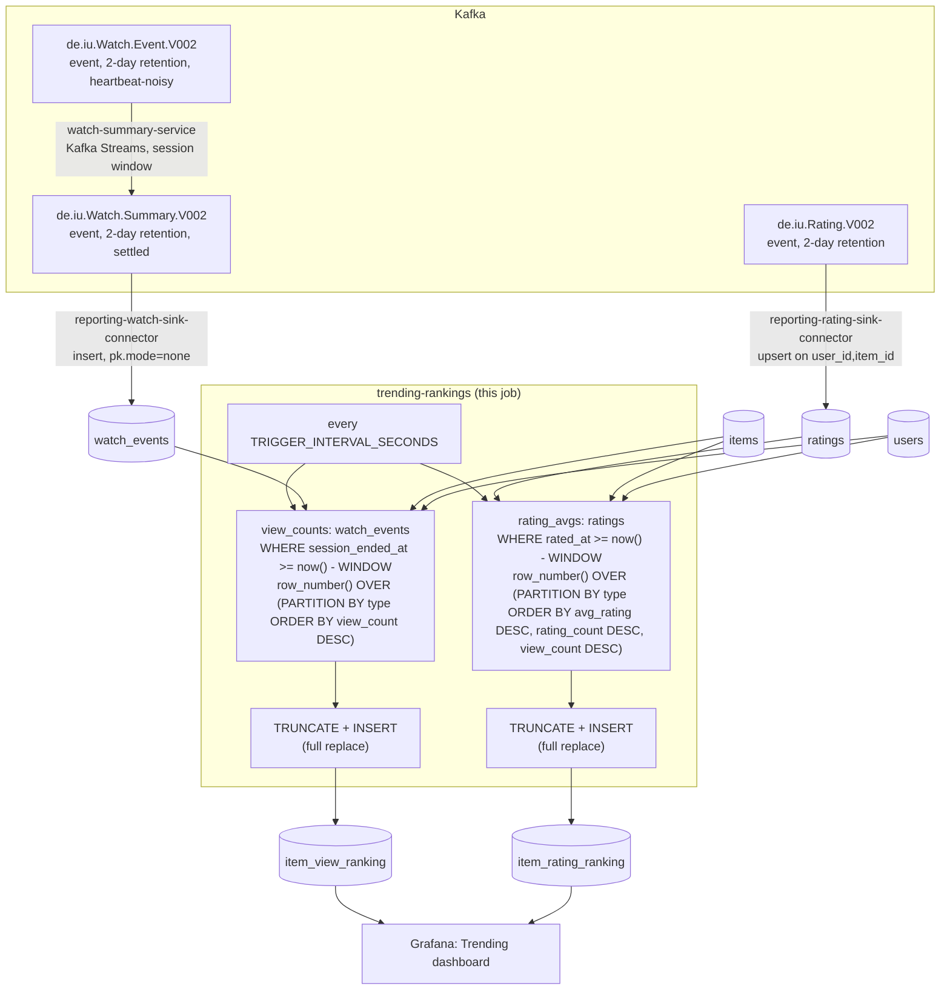

# trending-rankings

Rolling top-`TRENDING_TOP_N` series/movies (default 10), by view count and
by average rating, over the last `TRENDING_WINDOW_MINUTES` (default 10). A
periodic SQL query against `reporting-db`.

## What it computes

Two independent rankings, each split by `type` (movie/series), each
recomputed relative to wall-clock "now" every tick:

- **`item_view_ranking`** — top `TRENDING_TOP_N` by `watch_events` count
  in the last `TRENDING_WINDOW_MINUTES`.
- **`item_rating_ranking`** — top `TRENDING_TOP_N` by average `ratings`
  value in the same window, tiebroken by `rating_count` then by
  `view_count` (the same window's view count, `0` if the item has none —
  matches what the Grafana Trending dashboard actually shows).

Both tables are keyed by `(type, rank)` and **fully replaced** (`TRUNCATE`
+ insert in one transaction) every tick, not upserted — a top-N list has
no stable per-row identity to upsert against once the *set* of qualifying
items changes.

**Rolling, not a fixed bucket.** Every tick filters
`session_ended_at`/`rated_at >= now() - TRENDING_WINDOW_MINUTES`,
recomputed relative to *now* each time, not a tumbling time bucket. A
rating only counts toward "trending now" if it was given/updated inside
the window — a user's technically-current rating for an item doesn't
count if they gave it outside the window, even though it counts toward
that item's all-time average in `item_rating_avg`.

Ratings/watches from a deleted item or user are excluded (`INNER JOIN`
against live `items`/`users`), same rule every job in this directory
follows.

## Job graph



## Validation

```bash
docker compose exec reporting-db psql -U reporting -d reporting \
  -c "select type, rank, item_id, view_count from item_view_ranking order by type, rank;"
```
Each `type` should have at most `TRENDING_TOP_N` rows, ranks `1..N` with
no gaps. Watch several `client-input` sessions finish the same item within
`TRENDING_WINDOW_MINUTES` and confirm it climbs `item_view_ranking`'s
`view_count` within one `TRIGGER_INTERVAL_SECONDS`; wait past the window
and confirm it drops back off.
