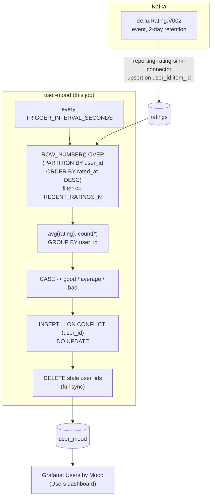

# user-mood

Classifies each user into **good** / **average** / **bad**, from the
average of their **last <=3 ratings** — a per-user recency rank, not a
time window. A periodic SQL query against `reporting-db`.

## What it computes

- **good** — average of last <=3 ratings > 4.5
- **average** — 3.5 <= average <= 4.5
- **bad** — average < 3.5

Written to `reporting-db.user_mood` as `mood`, `avg_recent_rating`,
`ratings_used` (however many of the last 3 the user actually has — 1 or
2 still get a mood, not just users with a full 3).

"Last <=3" means most recent by `rated_at`, not the 3 most recently
*inserted* rows — a per-user recency rank, expressed directly as
`ROW_NUMBER() OVER (PARTITION BY user_id ORDER BY rated_at DESC)`, native
SQL against the `ratings` table (mirrored from `de.iu.Rating.V002` by
`reporting-rating-sink-connector` — see
`../../connect/reporting-rating-sink-connector.json`). Ratings for a
deleted item or user can't exist here in the first place — `ratings`'s
`FOREIGN KEY ... ON DELETE CASCADE` against `items`/`users` (see
`../user-rating-avg/README.md`) means no join against those tables is
needed.

## Job graph



## Validation

```bash
docker compose exec reporting-db psql -U reporting -d reporting \
  -c "select * from user_mood;"
```
`mood` should be exactly one of `good`/`average`/`bad`, consistent with
`avg_recent_rating` against the >4.5 / 3.5-4.5 / <3.5 thresholds.
