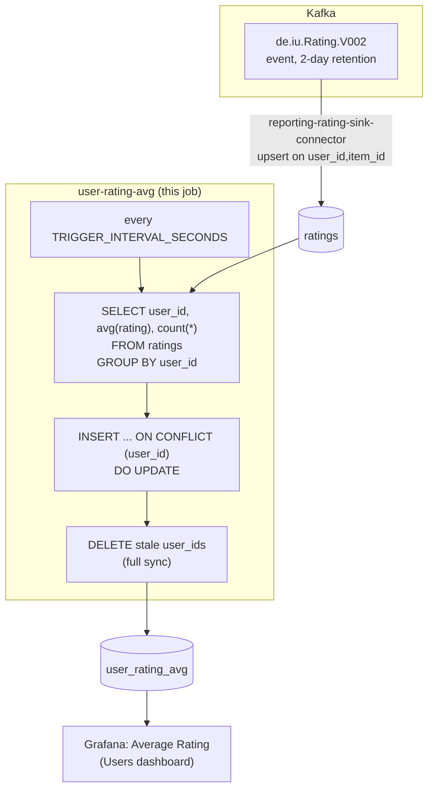

# user-rating-avg

All-time average rating per user. A periodic SQL query against
`reporting-db`.

## What it computes

For every user with at least one live rating: `avg_rating` (mean of
`rating` across every rating they've ever given) and `rating_count`
(count of *distinct items* they've rated — not total rating events).
Written to `reporting-db.user_rating_avg`, keyed by `user_id`.

**Latest rating per `(user_id, item_id)` wins.** If a user re-rates the
same item (a rewatch), only their most recent rating for that item
counts — earlier ones are superseded, not blended in. This is enforced
once, upstream, by `reporting-rating-sink-connector`'s own
`pk.mode=record_key` + `insert.mode=upsert` on `(user_id, item_id)` —
Postgres's `ON CONFLICT` gives "latest wins" directly, so `ratings` only
ever holds one row per `(user_id, item_id)` and this job doesn't need to
dedup anything.

**Ratings for a deleted item or user don't count — because they can't
exist.** `ratings.item_id`/`user_id` carry a `FOREIGN KEY ... ON DELETE
CASCADE` against `items`/`users` (`reporting-output/postgres/init/01_schema.sql`),
so deleting an item/user removes its ratings in the same transaction.
This job doesn't need to join against `items`/`users` to filter them out.

## Job graph



## Validation

```bash
docker compose exec reporting-db psql -U reporting -d reporting \
  -c "select count(*), min(avg_rating), max(avg_rating) from user_rating_avg;"
```
`avg_rating` should be within 1-5 (the rating scale) for every row.
Watch a `client-input` session finish an item and rate it, and confirm
the matching row's `rating_count` increments within one
`TRIGGER_INTERVAL_SECONDS`.
