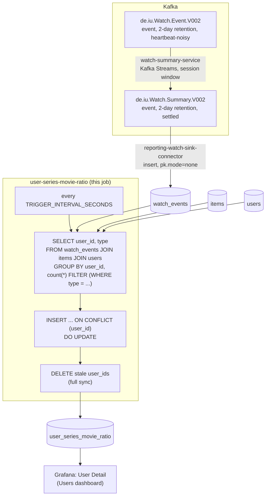

# user-series-movie-ratio

All-time movie/series watch percentage per user. A periodic SQL query
against `reporting-db`.

## What it computes

For every user with at least one live watch: `movie_watch_count` /
`series_watch_count` (raw counts) and `movie_percentage` /
`series_percentage` (each in `[0, 1]`, always summing to 1 for a row that
exists). Written to `reporting-db.user_series_movie_ratio`, keyed by
`user_id`.

**Every watch event counts, not deduped to "distinct items watched".**
Unlike `ratings` (one row per `(user_id, item_id)`, latest wins),
`watch_events` is an insert-only mirror of an append-only topic — a
rewatch is a second genuine row, and should count toward the percentages
same as any other watch; deduping would silently undercount someone who
rewatches a lot of one type.

**Watches for a deleted item or user don't count.** `watch_events` is
inner-joined against `items`/`users` before aggregating, same rule
`user-rating-avg` applies to `ratings`.

## Job graph



`reporting-watch-sink-connector` mirrors every settled watch into
`watch_events` as it arrives (insert-only — see
`../../connect/reporting-watch-sink-connector.json` — `pk.mode=none`
instead of `record_key`, since the event's own key repeats on a rewatch
and there's nothing to upsert against; `watch_events.id` is a plain
surrogate `BIGSERIAL`). With the source a real, indexed Postgres table,
"movie vs. series watch percentage per user" is a `GROUP BY` with a
`FILTER` clause.

## Validation

```bash
docker compose exec reporting-db psql -U reporting -d reporting \
  -c "select count(*), avg(movie_percentage) from user_series_movie_ratio;"
```
`movie_percentage`/`series_percentage` should each be within `[0, 1]` and
sum to 1 for every row. Watch a `client-input` session finish an item and
confirm the matching row's `movie_watch_count`/`series_watch_count`
increments within one `TRIGGER_INTERVAL_SECONDS`.
