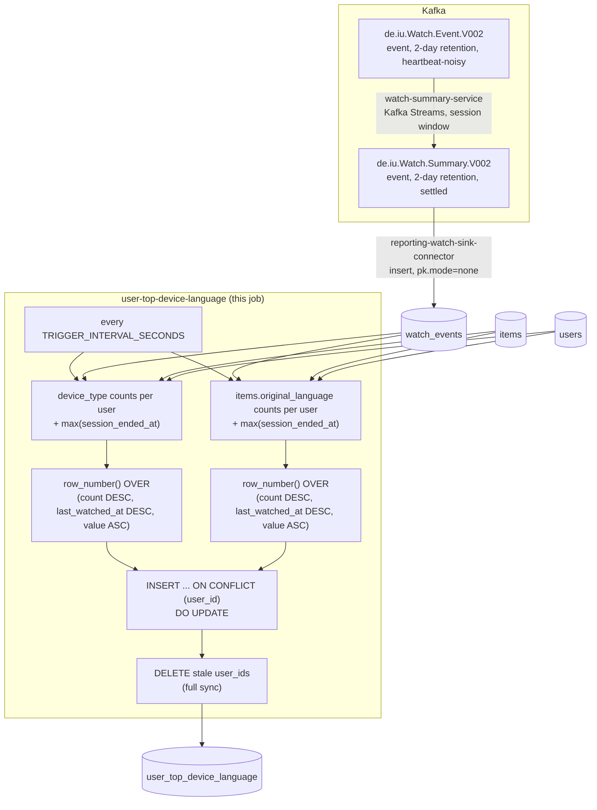

# user-top-device-language

Each user's most-used device and most-watched original language, both
all-time. A periodic SQL query against `reporting-db`.

## What it computes

For every user with at least one live watch: `top_device`
(`device_type`, e.g. `smart_tv`) and `device_watch_count` (how many live
watches used it), plus `top_language` (`items.original_language`) and
`language_watch_count` — nullable, since a user whose entire history is
null-language items has no language to report. Written to
`reporting-db.user_top_device_language`, keyed by `user_id`.

**All-time frequency, not a recency window** — unlike
`../user-top-genre/README.md`'s last-N-watches rank, every live watch a
user has ever made counts toward the device/language mode here. Ties in
the count are broken by whichever candidate's most recent watch is more
recent; a still-unresolved tie falls back to the candidate's own value
ascending (arbitrary but deterministic, so the result doesn't flip
between identical-looking ticks).

`device_type` is always present on a live watch (validated non-empty at
produce time in `client-input/generator.py`), so every user with any live
watch gets a `top_device`. `original_language` is nullable in the catalog
schema; a null-language watch still counts as a watch but casts no vote
toward the language mode.

## Job graph



## Validation

```bash
docker compose exec reporting-db psql -U reporting -d reporting \
  -c "select top_device, count(*) from user_top_device_language group by top_device order by 2 desc;"
```
Every row's `device_watch_count`/`language_watch_count` should be
`<=` that user's total live watch count. Watch a `client-input` session
finish several items on the same device and confirm the matching row's
`top_device` follows within one `TRIGGER_INTERVAL_SECONDS`. Force a tie
(equal counts on two devices) and confirm `top_device` picks whichever
was watched more recently, not an arbitrary one.
