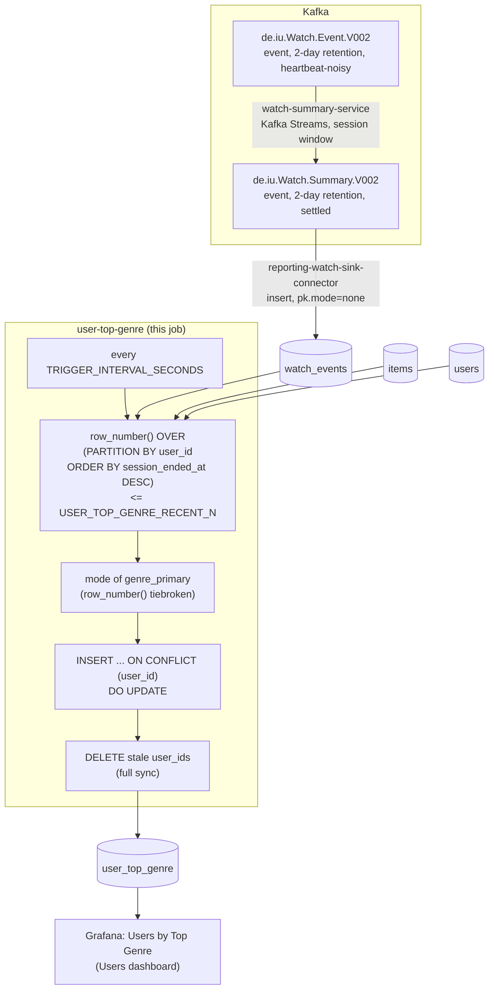

# user-top-genre

Most-watched primary genre per user, over their last `USER_TOP_GENRE_RECENT_N`
watches (default 8). A periodic SQL query against `reporting-db`.

## What it computes

For every user with at least one recent watch that carries a genre:
`top_genre` (mode of `genre_primary` over their last N watches),
`genre_watch_count` (how many of those watches were that genre), and
`watches_used` (how many of the last N watches had a non-null genre at
all). Written to `reporting-db.user_top_genre`, keyed by `user_id`.

**"Last N watches" is a per-user recency rank**, not a time window —
`row_number() OVER (PARTITION BY user_id ORDER BY session_ended_at DESC)`,
the same pattern `../user-mood/job.py` established for "last 3 ratings".

The recency window is picked from **all** of a user's watches, genre or
not, before the genre lookup — so "last 8" always means the 8 most recent
watch events, not the 8 most recent watches that happen to carry a genre.
A null-genre watch still occupies a recency slot but casts no vote toward
the mode; a user whose entire recent window is null-genre watches is
dropped from the table by the full-sync delete. Ties in the mode are
broken by `genre_primary` ascending — arbitrary but deterministic.

## Job graph



## Validation

```bash
docker compose exec reporting-db psql -U reporting -d reporting \
  -c "select top_genre, count(*) from user_top_genre group by top_genre order by 2 desc;"
```
Every row's `watches_used` should be `<= USER_TOP_GENRE_RECENT_N`. Watch a
`client-input` session finish several items of the same genre for one
user and confirm their row's `top_genre` follows within one
`TRIGGER_INTERVAL_SECONDS`.
