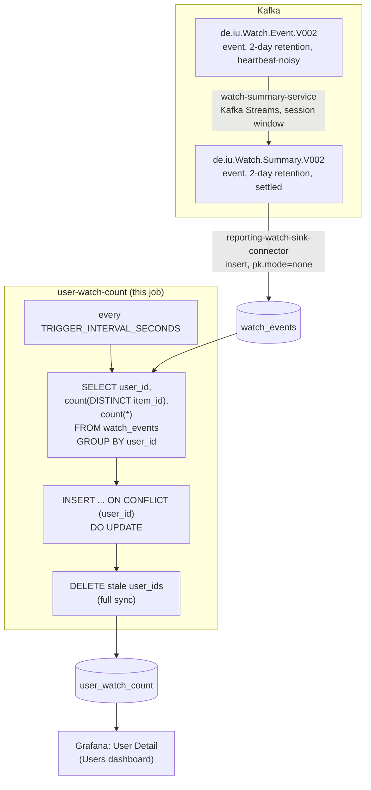

# user-watch-count

Two watch counts per user: how many distinct items they've watched, and
how many watch events they've generated in total (rewatches included). A
periodic SQL query against `reporting-db`, same shape as every other job
in this directory (`reporting-watch-sink-connector` mirrors
`de.iu.Watch.Summary.V002` into `watch_events`).

## What it computes

For every user with at least one live watch: `distinct_items_watched`
(`count(distinct item_id)`) and `total_watches` (`count(*)`). Written to
`reporting-db.user_watch_count`, keyed by `user_id`.

These are deliberately two different numbers — same reasoning
[`../item-completion-rate/README.md`](../item-completion-rate/README.md)
gives for "completion rate" being a different question from "average
fraction watched": a user who rewatches the same handful of items a lot
has a low `distinct_items_watched` but a high `total_watches`, and *that
gap* is the signal a single count wouldn't show. Not split by movie/series
— that breakdown already exists in `user_series_movie_ratio`.

Watches for a deleted item or user can't exist here in the first place —
`watch_events.item_id`/`user_id` carry a `FOREIGN KEY ... ON DELETE
CASCADE` against `items`/`users` (`reporting-output/postgres/init/01_schema.sql`),
so no join against those tables is needed. The table is fully synced
every tick (a user_id missing from this tick's result has its row
deleted, not left stale).

## Job graph



## Validation

```bash
docker compose exec reporting-db psql -U reporting -d reporting \
  -c "select user_id, distinct_items_watched, total_watches from user_watch_count order by total_watches desc limit 10;"
```
Every row should have `total_watches >= distinct_items_watched` (a
rewatch can only add to the gap, never shrink it below 1:1). Watch a
`client-input` session finish a couple of items — including a rewatch of
one it already finished — and confirm the matching row's counts diverge
within one `TRIGGER_INTERVAL_SECONDS`.
