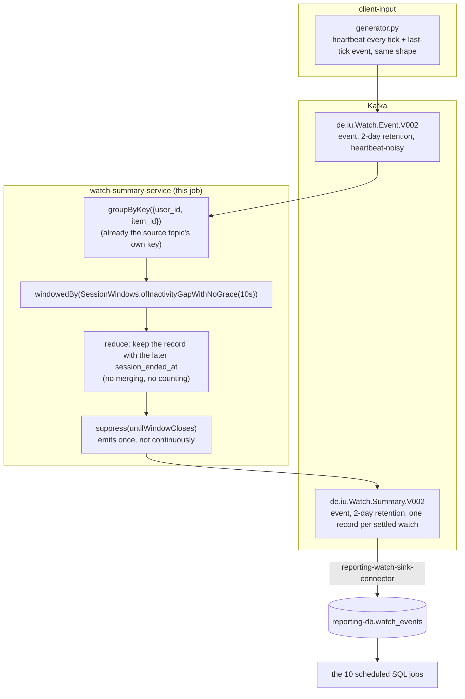

# watch-summary

The one genuine stream-processing job in this project — a Kafka Streams
app, not Python/SQL like everything else here. See "Why Kafka Streams,
not SQL" below for why this one earns it where the other jobs in this
project don't.

## What it computes

`client-input` now publishes a message to `de.iu.Watch.Event.V002` every
tick for every item currently being watched (a heartbeat), plus whatever
tick an item happens to conclude on — there's no separate "finished"
event on the wire any more (see `../client-input/README.md`). This job
session-windows that stream on a **10s inactivity gap**
(`SESSION_GAP_SECONDS`), keyed by the topic's own `{user_id, item_id}`,
and keeps only the record with the latest `session_ended_at` in each
window — never merges fields across records, never counts. Once the gap
elapses with nothing new for that key, it republishes exactly that one
record, unchanged in shape, to `de.iu.Watch.Summary.V002` — same
key/value schema as `Watch.Event.V002`.

**No aggregation.** A rewatch of the same item stays two independent
outputs as long as the two watches are more than `SESSION_GAP_SECONDS`
apart (true in effectively every realistic case — a rewatch takes at
least a full tick cycle to set up). There's no `watch_count` anywhere;
this job only ever decides "which one record survives," never combines
several into one.

**Emergent abandon-via-silence detection.** Because the window only
closes 10s after the *last* signal for a given `(user_id, item_id)`, a
real client that went silent mid-watch (crashed, network partition —
`client-input`'s own generator never simulates this, but the wire format
doesn't rule it out) looks identical to a normal finish: heartbeats just
stop. The job can't tell the two apart and doesn't need to — either way
it emits a `Watch.Summary.V002` record once the gap elapses, using
whatever position the last heartbeat reported. This wasn't a separate
requirement; it falls straight out of using a heartbeat + inactivity-gap
design for the "watch finished" signal in the first place.

**Heartbeat cadence is fixed, not tunable.** `client-input`'s
`tick_seconds` is a hard-coded 5s, not a runtime-editable dashboard
control, specifically because this job's correctness depends on it
staying comfortably under half of `SESSION_GAP_SECONDS` — see
`../client-input/README.md`. Raising it would risk this job seeing false
"abandoned" summaries mid-watch.

## Job graph



## Stream time, grace period, and lateness

Kafka Streams doesn't have an explicit watermark API the way some other
stream-processing engines do. The closest analog is **stream time**
(per-partition, advances to the max record timestamp seen so far on that
partition — not a globally-injected signal) plus a **grace period** on
the windowed operation, which controls how long past a window's nominal
end late records are still accepted before the window is irrevocably
closed.

This job's `SessionWindows.ofInactivityGapWithNoGrace(...)` sets that
grace period to **zero** — no lateness tolerance at all. Two distinct
behaviors worth not conflating:

- **Waits for inactivity**: yes, that's the entire point of a session
  window — it holds off finalizing a `(user_id, item_id)`'s result until
  `SESSION_GAP_SECONDS` of stream time has passed with nothing further
  for that key.
- **Waits for late events**: no. The instant stream time crosses
  `last-event + gap`, the window is final. A record for that key arriving
  after that point either starts a *new* session window (if its own
  timestamp is far enough past the old one) or, if the old window has
  already been purged from the state store, is effectively dropped rather
  than retroactively merged into it. `suppress(untilWindowCloses)` adds no
  waiting of its own on top of this — it only withholds intermediate
  updates and emits once, at whatever moment the window-closure logic
  above already decided the window is done.

This is a safe assumption here because `client-input` produces heartbeats
directly to Kafka in real time with no upstream buffering or reordering
hop — not because Kafka in general guarantees in-order delivery across
retries/multiple producers. If a future producer path introduced
retries, batching, or multiple concurrent producer instances for the
same key, zero grace would mean genuinely late data gets silently
dropped rather than reopening the window it belonged to.

One more consequence of stream time being per-**partition**, not
per-key: a specific `(user_id, item_id)`'s window doesn't close on a
wall-clock timer — it closes when stream time advances past its
threshold, which only happens when *some* record lands on that
partition. In practice this is a non-issue since `client-input` normally
has many concurrent sessions spread across all 4 partitions, keeping
stream time advancing close to real time — but a fully idle partition
(no heartbeats from any session on it) would leave a pending window open
until the next record arrives there, however long that takes.

## Why Kafka Streams, not SQL

The other ten `reporting-output` jobs (`trending-rankings`,
`user-series-movie-ratio`, `item-completion-rate`, `user-top-genre`,
`user-rating-avg`, `item-rating-avg`, `user-mood`, `user-watch-count`,
`user-top-device-language`, `item-viewer-demographics`)
are all plain scheduled SQL: each does a **full-table recompute every
tick** (all-time ratios, rolling top-N rankings) against an indexed
Postgres mirror of its source topics — a `GROUP BY` or a window-function
ranking, re-run on a timer. That shape doesn't need a streaming engine at
all once a real table exists to query.

This job is the opposite shape: it's inherently incremental and
event-triggered (fire once when a gap closes), not a periodic full
recompute. A relational poll can't express "wait for N seconds of
silence on this specific key, then act" without its own bookkeeping
table and its own re-implementation of session-window semantics — Kafka
Streams' `SessionWindows` + `suppress(untilWindowCloses)` already do
exactly this as a first-class primitive. That's what "genuinely earns
Kafka Streams" means here, as opposed to the other ten jobs, which
never needed a streaming engine in the first place.

## Configuration

| Env var | Default | Notes |
|---|---|---|
| `KAFKA_BOOTSTRAP` | `kafka:29092` | |
| `SCHEMA_REGISTRY_URL` | `http://schema-registry:8081` | |
| `SESSION_GAP_SECONDS` | `10` | Coupled to `client-input`'s fixed 5s heartbeat cadence — see above. Not meant to change independently of it. |

`application.id` is fixed in code (`watch-summary-service`) — no
repartition topic is needed since the grouping key already matches the
source topic's own key.

## kPow visibility

Shows up in kPow as a plain consumer group (`watch-summary-service`),
same as any consumer — no extra wiring needed for that. kPow's *dedicated*
Kafka Streams view (topology, per-instance state) is Enterprise-only and
this stack runs `kpow-ce` (Community Edition), which can't render it —
see `../ENTERPRISE_ARCHITECTURE.md`'s Observability section.

## Validation

```bash
docker compose logs -f client-input          # confirm heartbeats landing on Watch.Event.V002 every tick
docker compose logs -f watch-summary-service  # confirm the topology starts cleanly
docker compose exec kafka kafka-console-consumer \
  --bootstrap-server localhost:9092 \
  --topic de.iu.Watch.Summary.V002 --from-beginning --max-messages 5
```
Watch one item finish normally in the Client Input dashboard. Within
`SESSION_GAP_SECONDS` of the last heartbeat, exactly one
`WatchSummaryEvent` should appear for that `(user_id, item_id)`, with
`watched_seconds` matching what the dashboard's "recently finished" log
shows — and nothing further for that same watch afterward. Force a
rewatch of the same item well past `SESSION_GAP_SECONDS` and confirm two
independent summaries, not one merged/counted record.
